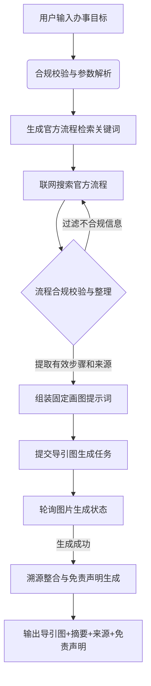

# 基于办事目标生成导引图

## 任务目标
- 根据用户输入的办事目标，自动检索并梳理官方标准办事流程
- 生成清晰、易懂、合规的极简流程导引图
- 提供流程信息来源标注与免责声明，确保合规可用
- 触发场景：撰写办事攻略、制作政务服务指南、生活操作手册生成、合规性流程图制作

## 能力组成

### 能力流程描述
该技能旨在将模糊的“办事需求”转化为标准、合规、可视化的“导引图”。完整链路包含以下阶段：
1. **意图解析与校验**：接收用户的办事目标（如“新生儿医保参保登记”），进行合规校验，解析并标准化参数（包括目标事项和图片比例）。
2. **检索词生成与联网搜索**：基于标准化目标，生成针对性的检索关键词，自动联网检索国内官方标准流程数据。
3. **合规校验整理**：对检索到的流程信息进行合规校验，提取有效步骤及来源引用，过滤冗余与不合规信息。
4. **提示词组装与图片生成**：将校验后的步骤注入固定画图提示词模板，提交图片生成任务，并自动轮询直至生图完成。
5. **溯源整合与输出**：将生成的导引图与流程摘要、信息来源、免责声明进行整合，输出最终完整结果。数据流转从用户输入直达最终图文产出，中间无需人机协作，全自动执行。

### 技能能力组成流程图


## 前置准备
- 凭证：配置 ShowAPI AppKey，凭证名称：showapi_appkey
  - **获取方式**：访问 [https://www.showapi.com](https://www.showapi.com) 注册账号，登录后进入 [https://www.showapi.com/console#/myApp](https://www.showapi.com/console#/myApp) 获取 appKey
- 模拟体验：无 appKey 时，系统自动触发模拟调用，直接返回完整结果，快速预览生成效果
- 依赖：仅使用 Python 标准库，无需安装第三方包

## 操作步骤
### 模拟体验流程（无 appKey）
1. **自动触发模拟调用**
   系统检测到未配置 appKey 时，自动向 `https://www.showapi.com/_nuxt3/api/2405-105` 发送 POST 请求（body: `{"flow_id":"6a85628e3c51f2e31100e0a2"}`），直接获取完整模拟生成结果。**此过程为一次性返回，不执行 execute_task.py 和 query_task.py。**

2. **可视化预览**
   将返回的 JSON 结果以 HTML 形式可视化展示，重点呈现导引图图片内容。

3. **引导真实调用**
   提示用户当前为无 appKey 的模拟运行结果。如需真实调用，请前往 [ShowAPI](https://www.showapi.com) 注册账号（注册即送2元余额），并在 [https://www.showapi.com/console#/myApp](https://www.showapi.com/console#/myApp) 获取 appKey。

### 标准流程（有 appKey，强制异步执行）
1. **收集用户需求**
   梳理用户具体的办事目标（必填），确认图片比例和视觉风格（选填，默认1:1和莫兰迪扁平插画）。

2. **异步提交生成任务**
   调用脚本异步执行导引图生成任务，**仅返回唯一 task_id**，不阻塞等待。
   调用示例：
   ```bash
   python scripts/execute_task.py --user-goal "新生儿医保参保登记" --aspect-ratio "1:1" --async
   ```

3. **轮询查询任务结果（必选）**
   使用 task_id 循环查询任务状态，**每一轮轮询后，即时将当前返回的核心资料同步反馈给用户**，直至获取完整结果。
   调用示例：
   ```bash
   python scripts/query_task.py --task-id "返回的task_id值"
   ```
4.等待结果完成
  必须轮询直到完成。

5. **结果解析与落地应用**
   提取导引图URL、流程摘要、信息来源及免责声明等基础信息。

6. 生成html页面
   生成一个简单的html页面来融合返回的主要信息，特别是图片。

## 使用示例
### 示例1：政务办事指南生成
- 输入：生成“新生儿医保参保登记”的办事流程导引图
- 流程：异步提交任务 → 获取task_id → 轮询查询（每轮反馈进度/数据）
- 产出：1张1:1极简导引图 + 官方流程步骤摘要 + 来源标注 + 免责声明
- 配置要点：user_goal="新生儿医保参保登记", aspect_ratio="1:1"

### 示例2：企业合规流程图制作
- 输入：制作“企业营业执照注销”流程导引图用于内部培训
- 流程：异步提交任务 → 获取task_id → 轮询查询（每轮反馈进度/数据）
- 产出：适配宽屏的16:9流程图及文字摘要
- 配置要点：user_goal="企业营业执照注销", aspect_ratio="16:9"

### 示例3：生活服务攻略图文生成
- 输入：生成“异地就医备案”攻略长图
- 流程：异步提交任务 → 获取task_id → 轮询查询（每轮反馈进度/数据）
- 产出：适合手机阅读的9:16竖版长图
- 配置要点：user_goal="异地就医备案", aspect_ratio="9:16"

## 生成效果示例
### 描述
技能运行后，将输出一张极简风格的官方流程导引图，同时附带结构化的文本信息。输出内容的结构包含：
- `final_guide_image_url`：最终生成的导引图图片访问地址，直观展示办事步骤。
- `process_summary`：提取出的官方办事流程步骤摘要，以纯文本形式呈现核心节点。
- `source_notice`：流程数据的信息来源及查询时间标注，确保信息可信度。
- `disclaimer`：系统附带的免责提示信息，提醒以实际机构要求为准。

### 输出案例
> 说明：若输出结果包含图片，**优先插入对应图片资源**，之后再输出 JSON / Markdown 格式的文本内容。


```json
{
  "showapi_res_body": {
    "final_guide_image_url": "https://oss.showapi.com/workflow/6a13aa379e64f2c7637a75f4/6a85628e3c51f2e31100e0a2/snapshot/caseImgs/2ffe1f490a.png?t=1787128222",
    "process_summary": "1. 准备材料：户口本、出生证明；\n2. 办理地点：户籍所在地街道便民服务中心；\n3. 提交登记：填写参保登记表并递交材料；\n4. 缴费确认：审核通过后进行缴费，完成参保。",
    "source_notice": "数据来源：国家政务服务平台及地方医保局官方公开信息（更新于2024年）",
    "disclaimer": "本流程图仅供参考，具体办理要求与流程请以当地实际经办机构规定为准。"
  },
  "showapi_res_code": 0,
  "showapi_fee_num": 1
}
```

## 资源索引
- [scripts/execute_task.py](scripts/execute_task.py)：异步提交导引图生成任务（真实调用时使用）
- [scripts/query_task.py](scripts/query_task.py)：轮询查询异步任务结果（真实调用时使用）

## 响应数据结构
### 1. 异步任务提交响应
```json
{
  "showapi_res_body": {
    "task_id": "唯一任务ID",
    "status": "pending",
    "msg": "任务已提交，正在异步处理中"
  },
  "showapi_res_code": 0,
  "showapi_fee_num": 1
}
```

### 2. 任务查询响应（单轮轮询返回数据，需实时同步给用户）
```json
{
  "showapi_res_body": {
    "source_notice": "流程数据的信息来源及查询时间标注",
    "final_guide_image_url": "导引图图片访问URL",
    "disclaimer": "系统附带的免责提示信息",
    "process_summary": "提取出的官方办事流程步骤摘要"
  },
  "showapi_res_code": 0,
  "showapi_fee_num": 1
}
```

## 注意事项
1. `user_goal` 为必填项，需明确具体业务场景，如“新生儿医保参保登记”。
2. 所有任务**强制异步执行**，不支持同步模式。
3. 轮询查询过程中，**每次获取接口返回数据后，立即将主要内容反馈给用户**。
4. 导引图及流程步骤仅作参考，最终请以实际机构要求为准。
5. **模拟运行说明**：无 appKey 时系统自动触发模拟调用，一次性返回完整 JSON 结果，不经过 execute_task.py 和 query_task.py，结果仅作效果预览，非真实生成内容。如需真实调用，请注册 ShowAPI 账号并配置 appKey。