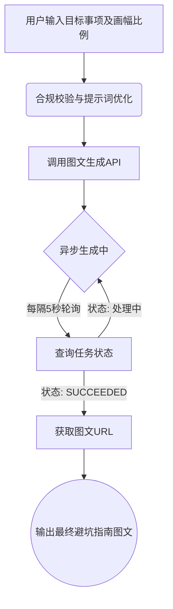

# 避坑指南图文生成

## 任务目标
- 快速生成高颜值、重点突出的避坑指南图文，支撑内容营销与流量变现
- 具备意图分析、图文排版、插画生成、文字精炼提取能力
- 触发场景：制作小红书避坑图文、设计视频封面、编写朋友圈攻略、海报制作等

## 能力组成

### 能力流程描述
该技能基于用户输入的目标事项（如“夜市品尝小吃”），自动化生成避坑指南图文。整体流程分为三个核心阶段：
1. **合规校验优化**：首先对用户输入的主题进行合规性检查及提示词优化，确保内容安全并生成高质量的绘图指令。
2. **异步生成图文**：调用图文生成API（采用清爽扁平化插画风格，莫兰迪低饱和色系，留白式卡片布局），将生成的指令传入并异步出图。
3. **轮询获取结果**：由于出图过程需要一定时间，系统自动发起轮询请求，每隔5秒查询一次生成状态，直至任务成功并返回最终的图文URL。

### 技能能力组成流程图


## 前置准备
- 凭证：配置 ShowAPI AppKey，凭证名称：showapi_appkey
  - **获取方式**：访问 [https://www.showapi.com](https://www.showapi.com) 注册账号，登录后进入 [https://www.showapi.com/console#/myApp](https://www.showapi.com/console#/myApp) 获取 appKey
- 模拟体验：无 appKey 时，系统自动触发模拟调用，直接返回完整结果，快速预览生成效果
- 依赖：仅使用 Python 标准库，无需安装第三方包

## 操作步骤
### 模拟体验流程（无 appKey）
1. **自动触发模拟调用**
   系统检测到未配置 appKey 时，自动向 `https://www.showapi.com/_nuxt3/api/2405-105` 发送 POST 请求（body: `{"flow_id":"6a7003ca3c51f2ec21006edd"}`），直接获取完整模拟生成结果。**此过程为一次性返回，不执行 execute_task.py 和 query_task.py。**

2. **可视化预览**
   将返回的 JSON 结果以 HTML 形式可视化展示，重点呈现图片内容。

3. **引导真实调用**
   提示用户当前为无 appKey 的模拟运行结果。如需真实调用，请前往 [ShowAPI](https://www.showapi.com) 注册账号（注册即送2元余额），并在 [https://www.showapi.com/console#/myApp](https://www.showapi.com/console#/myApp) 获取 appKey。

### 标准流程（有 appKey，强制异步执行）
1. **收集用户需求**
   梳理用户需求，明确目标事项（如“夜市品尝小吃”），选择合适的画幅比例（3:4、16:9、1:1）。

2. **异步提交生成任务**
   调用脚本异步执行图文生成任务，**仅返回唯一 task_id**，不阻塞等待。
   调用示例：
   ```bash
   python scripts/execute_task.py --question "夜市品尝小吃" --aspect-ratio "3:4"
   ```

3. **轮询查询任务结果（必选）**
   使用 task_id 循环查询任务状态，**每一轮轮询后，即时将当前返回的核心资料同步反馈给用户**，直至获取完整结果。
   调用示例：
   ```bash
   python scripts/query_task.py --task-id "返回的task_id值"
   ```
4.等待结果完成
  必须轮询直到完成。

5. **结果解析与落地应用**
   提取生成的图文URL，结合目标事项的核心要点，为用户提供避坑指南应用建议。

6. 生成html页面
   生成一个简单的html页面来融合返回的主要信息，特别是图片。

## 使用示例
### 示例1：小红书避坑图文生成
- 输入：为“夜市品尝小吃”生成一张小红书风格的避坑指南图文
- 流程：异步提交任务 → 获取task_id → 轮询查询（每轮反馈进度/数据）
- 产出：3:4比例的清爽扁平化插画图文，重点突出避坑要点
- 配置要点：aspect_ratio="3:4"

### 示例2：朋友圈避坑攻略分享
- 输入：生成“新手购买二手车”的避坑指南
- 流程：异步提交任务 → 获取task_id → 轮询查询（每轮反馈进度/数据）
- 产出：1:1比例的图文卡片，适合朋友圈发布
- 配置要点：aspect_ratio="1:1"

### 示例3：视频封面图制作
- 输入：制作“租房防骗指南”的视频封面
- 流程：异步提交任务 → 获取task_id → 轮询查询（每轮反馈进度/数据）
- 产出：16:9比例的横版图文，适合视频封面
- 配置要点：aspect_ratio="16:9"

## 生成效果示例
### 描述
技能运行后，将输出一个包含最终图文URL的结果。图文样式采用清爽扁平化插画风格，莫兰迪低饱和色系，构图采用留白式卡片布局，文字精炼且重点突出。用户可通过该URL访问并下载生成的避坑指南图片。

### 输出案例
> 说明：若输出结果包含图片，**优先插入对应图片资源**，之后再输出 JSON / Markdown 格式的文本内容。


```json
{
  "showapi_res_body": {
    "result_url": "https://oss.showapi.com/workflow/.../pitfall_guide_image.png",
    "task_status": "SUCCEEDED"
  },
  "showapi_res_code": 0,
  "showapi_fee_num": 1
}
```

## 资源索引
- [scripts/execute_task.py](scripts/execute_task.py)：异步提交避坑图文生成任务（真实调用时使用）
- [scripts/query_task.py](scripts/query_task.py)：轮询查询异步任务结果（真实调用时使用）

## 响应数据结构
### 1. 异步任务提交响应
```json
{
  "showapi_res_body": {
    "task_id": "唯一任务ID",
    "status": "pending",
    "msg": "任务已提交，正在异步处理中"
  },
  "showapi_res_code": 0,
  "showapi_fee_num": 1
}
```

### 2. 任务查询响应（单轮轮询返回数据，需实时同步给用户）
```json
{
  "showapi_res_body": {
    "task_status": "SUCCEEDED",
    "result_url": "生成的避坑指南图文URL"
  },
  "showapi_res_code": 0,
  "showapi_fee_num": 1
}
```

## 注意事项
1. question 为必填项，需清晰描述目标事项。
2. 所有任务**强制异步执行**，不支持同步模式。
3. 轮询查询过程中，**每次获取接口返回数据后，立即将主要内容反馈给用户**。
4. 画幅比例支持 3:4(小红书/海报)、16:9(视频封面)、1:1(朋友圈)，默认为 3:4。
5. **模拟运行说明**：无 appKey 时系统自动触发模拟调用，一次性返回完整 JSON 结果，不经过 execute_task.py 和 query_task.py，结果仅作效果预览，非真实生成内容。如需真实调用，请注册 ShowAPI 账号并配置 appKey。