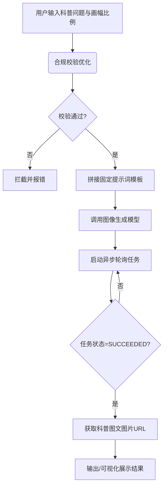

# 十万个为什么科普图文生成

## 任务目标
- 根据用户提出的科普问题，快速生成画面精美、文字简练且精准的儿童科普图文
- 具备意图合规校验、固定提示词模板拼接、高清图像生成、异步轮询状态等能力
- 触发场景：解答儿童日常提问、制作儿童科普内容、早教图文素材生成、丰富科普问答互动

## 能力组成

### 能力流程描述
1. **输入校验与参数整合**：接收用户输入的科普问题（必填）和画幅比例（选填，默认3:4），进行基础数据清洗。
2. **合规校验优化**：将用户问题输入至安全拦截模块，校验提问合规性，避免生成不适宜儿童的内容。
3. **拼接提示词并生成图文任务**：基于合规后的提问，自动拼接为固定模板（“推荐最适合3-8岁儿童的[提问]的科普图文，要求使用中文，文字尽量少，且精准”），调用高清图像生成模型发起生成任务。
4. **异步轮询获取结果**：启动每5秒一次的轮询机制，最长等待1200秒，直至模型返回最终生成的科普图文图片URL。
5. **输出交付**：将最终获取到的图片URL返回，并支持以HTML形式可视化展示给用户。

### 技能能力组成流程图


## 前置准备
- 凭证：配置 ShowAPI AppKey，凭证名称：showapi_appkey
  - **获取方式**：访问 [https://www.showapi.com](https://www.showapi.com) 注册账号，登录后进入 [https://www.showapi.com/console#/myApp](https://www.showapi.com/console#/myApp) 获取 appKey
- 模拟体验：无 appKey 时，系统自动触发模拟调用，直接返回完整结果，快速预览生成效果
- 依赖：仅使用 Python 标准库，无需安装第三方包

## 操作步骤
### 模拟体验流程（无 appKey）
1. **自动触发模拟调用**
   系统检测到未配置 appKey 时，自动向 `https://www.showapi.com/_nuxt3/api/2405-105` 发送 POST 请求（body: `{"flow_id":"6a6ff06a3c51f2ec21002bf8"}`），直接获取完整模拟生成结果。**此过程为一次性返回，不执行 execute_task.py 和 query_task.py。**

2. **可视化预览**
   将返回的 JSON 结果以 HTML 形式可视化展示，重点呈现图片内容。

3. **引导真实调用**
   提示用户当前为无 appKey 的模拟运行结果。如需真实调用，请前往 [ShowAPI](https://www.showapi.com) 注册账号（注册即送2元余额），并在 [https://www.showapi.com/console#/myApp](https://www.showapi.com/console#/myApp) 获取 appKey。

### 标准流程（有 appKey，强制异步执行）
1. **收集用户需求**
   梳理用户的科普问题，确认输出画幅比例（选填，默认3:4）。

2. **异步提交生成任务**
   调用脚本异步执行图文生成任务，**仅返回唯一 task_id**，不阻塞等待。
   调用示例：
   ```bash
   python scripts/execute_task.py --question "为什么海水不能喝？" --aspect-ratio 3:4 --async
   ```

3. **轮询查询任务结果（必选）**
   使用 task_id 循环查询任务状态，**每一轮轮询后，即时将当前返回的核心资料同步反馈给用户**，直至获取完整结果。
   调用示例：
   ```bash
   python scripts/query_task.py --task-id "返回的task_id值"
   ```
4.等待结果完成
  必须轮询直到完成。

5. **结果解析与落地应用**
   提取生成的科普图文URL，进行展示或下载。

6. 生成html页面
   生成一个简单的html页面来融合返回的主要信息，特别是图片。

## 使用示例
### 示例1：小红书儿童科普图文制作
- 输入：为什么天空是蓝色的？
- 流程：异步提交任务 → 获取task_id → 轮询查询（每轮反馈进度/数据）
- 产出：一张3:4比例的科普图文，包含简短的中文解释
- 配置要点：aspect_ratio=3:4

### 示例2：短视频封面生成
- 输入：为什么海水不能喝？
- 流程：异步提交任务 → 获取task_id → 轮询查询（每轮反馈进度/数据）
- 产出：一张16:9比例的科普图文，适合视频封面
- 配置要点：aspect_ratio=16:9

### 示例3：微信朋友圈科普
- 输入：为什么会有彩虹？
- 流程：异步提交任务 → 获取task_id → 轮询查询（每轮反馈进度/数据）
- 产出：一张1:1比例的图文，适合朋友圈展示
- 配置要点：aspect_ratio=1:1

## 生成效果示例
### 描述
该技能在实际运行后，将返回一个包含图片URL的JSON数据。用户可通过URL访问生成的科普图文，图片内容包含精准且适合3-8岁儿童认知的中文文字描述及配图。最终交付物适合直接用于儿童读物、短视频配图或社交平台科普传播。

### 输出案例
> 说明：若输出结果包含图片，**优先插入对应图片资源**，之后再输出 JSON / Markdown 格式的文本内容。


```json
{
  "showapi_res_body": {
    "image_url": "https://oss.showapi.com/temp/science_illustration_12345.png",
    "task_id": "6a6ff06a3c51f2ec21002bf8",
    "status": "SUCCEEDED"
  },
  "showapi_res_code": 0,
  "showapi_fee_num": 1
}
```

## 资源索引
- [scripts/execute_task.py](scripts/execute_task.py)：异步提交科普图文生成任务（真实调用时使用）
- [scripts/query_task.py](scripts/query_task.py)：轮询查询异步任务结果（真实调用时使用）

## 响应数据结构
### 1. 异步任务提交响应
```json
{
  "showapi_res_body": {
    "task_id": "唯一任务ID",
    "status": "pending",
    "msg": "任务已提交，正在异步处理中"
  },
  "showapi_res_code": 0,
  "showapi_fee_num": 1
}
```

### 2. 任务查询响应（单轮轮询返回数据，需实时同步给用户）
```json
{
  "showapi_res_body": {
    "image_url": "生成的科普图文图片URL",
    "task_status": "SUCCEEDED"
  },
  "showapi_res_code": 0,
  "showapi_fee_num": 1
}
```

## 注意事项
1. question 为必填项，需清晰描述具体的科普问题。
2. 所有任务**强制异步执行**，不支持同步模式。
3. 轮询查询过程中，**每次获取接口返回数据后，立即将主要内容反馈给用户**。
4. 生成的图片文字尽量少且精准，适配3-8岁儿童认知水平。
5. **模拟运行说明**：无 appKey 时系统自动触发模拟调用，一次性返回完整 JSON 结果，不经过 execute_task.py 和 query_task.py，结果仅作效果预览，非真实生成内容。如需真实调用，请注册 ShowAPI 账号并配置 appKey。