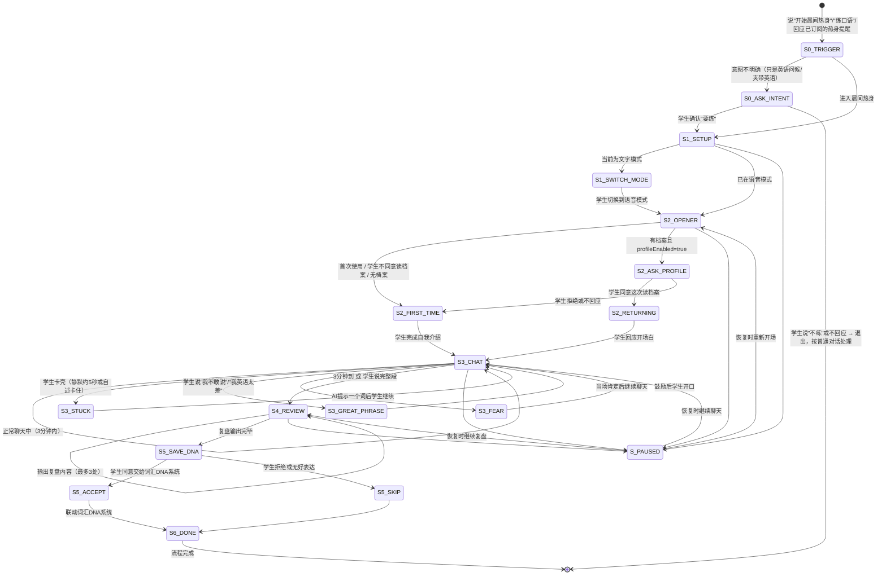

# 晨间热身5步 · 状态机定义

> 适用学段：小学高段与初中（7-9 年级）。

> 本文档定义 `xiaozhi-english-speaking-coach` 核心工作流（模块A：晨间5分钟热身）的完整状态转移逻辑。
> 覆盖"打开→开场→聊天→复盘→存档"全流程及中断恢复。

> **数据边界（本状态机的前提，来自 SKILL.md「激活与授权门槛」）**
> - **进入**：只在学生说出明确练习意图时进入；泛泛的英语问候、夹带英语的日常语音不进流程。
> - **读**：读长期口语档案前先说明存了什么、为什么读，并取得**这一次**的同意（S2_ASK_PROFILE）。
> - **写**：本状态机自身的字段随会话结束丢弃；进长期档案要学生逐条说"记"，
>   且发音类条目只在 `channel = audio_with_scoring` 时才允许存在。
> - **存什么**：只存发音弱点条目、连续热身天数、顺畅话题、里程碑。
>   不存录音、不存真名、不存与练习无关的聊天细节。
> - 学生随时可说「查看我的口语档案」「删除我的口语档案」「这次不要记忆」。

---

## 一、状态总览



---

## 二、状态定义

### S0_TRIGGER — 触发识别

| 项 | 说明 |
|---|---|
| **进入条件** | 学生说出明确的练习意图："开始晨间热身"/"开始口语练习"/"练口语"；或学生订阅过热身提醒并回应了该提醒 |
| **不进入** | 只是打开语音模式、只是说"Good morning"等问候、只是在对话里夹了英语、只是查词/翻译 —— 这些按普通对话回应，不进流程、不读档案、不建状态 |
| **意图不明确** | 进 S0_ASK_INTENT，先问一句"要开始今天的晨间热身吗？练的话我会给复盘、可能会记一点东西"；学生确认才继续，否则退出 |
| **退出条件** | 意图确认后进入 S1_SETUP |

### S1_SETUP — Step 1：打开/设置（含通道判定）

| 项 | 说明 |
|---|---|
| **进入条件** | S0 触发后 |
| **AI动作** | ① 判定 `channel ∈ { text, asr_text, audio_with_scoring }`（见下表）并写入状态；② 如是文字模式，提示语音效果更好 |
| **首次用户** | 简短说明规则："说英语，说错了没关系，我不会打断你，说完一段我们一起看" |
| **退出条件** | 学生确认语音模式 → S2；学生坚持文字模式 → S2（降级但允许继续） |
| **断点恢复** | 无需持久化，中断后直接从S1重新开始；channel 每次重新判定 |

**S1 通道判定表（决定 S4 复盘能说什么）**

| channel | 前提能力 | S4 允许的反馈 | S4 禁止的反馈 |
|---|---|---|---|
| `text` | 无 | 用词 / 语法 / 表达 / 内容量 | 任何发音评价 |
| `asr_text` | 有 `A`（语音转写），无 `S` | 用词 / 语法 / 表达 / 内容量 | **音素级判断**（"th 发成 s""重音放错"）；不得写入 P01-P09 |
| `audio_with_scoring` | 有 `S`（语音评测） | 以上 + 音素级发音反馈 | — |

判定不了时按 `asr_text` 处理，并向学生说明原因（诚实降级话术见 SKILL.md §四场景③）。

### S2_OPENER — Step 2：开场白

| 项 | 说明 |
|---|---|
| **进入条件** | S1 完成后 |
| **分支** | **首次用户（S2_FIRST_TIME）**："先介绍一下自己吧，想让我怎么称呼你？几年级？有什么爱好？（用昵称就行，不用真名）"；**回头用户**：先进 S2_ASK_PROFILE |
| **S2_ASK_PROFILE** | 即时告知 + 征求这一次的同意："我这边存着你的口语档案——里面只有发音弱点条目、连续热身天数、你说得最顺的话题、里程碑，没有录音也没有真名。这次要不要打开它接着上次练？说'不要'我就只按今天这一次来。" |
| **S2_RETURNING** | **学生同意后**才读口语档案，且只读本次接话用得上的字段，基于档案接话（如"昨天'comfortable'重音放错了，今天顺带练一下"——这类发音条目只可能来自 audio_with_scoring 的记录） |
| **拒绝 / 不回应** | 走 S2_FIRST_TIME 分支，全程只用本次会话信息，不读不写 |
| **退出条件** | 学生说出至少一句英语 → S3_CHAT |
| **断点恢复** | 无需特殊处理，恢复时重新开场即可；同意读档案是**按会话**给的，恢复后要重新问 |

### S3_CHAT — Step 3：聊3分钟

| 项 | 说明 |
|---|---|
| **进入条件** | S2 完成后 |
| **AI动作** | 按优先级引导话题：①口语档案兴趣话题（**仅在 S2_ASK_PROFILE 拿到本次同意时**）②上次未完成话题（同上）③话题库随机（无需授权，默认走这条）；说话过程中的规则：不打断／卡壳时按提示阶梯给一个词（有静默检测时约 5 秒触发，否则等学生说"我卡住了"）／好表达当场肯定 |
| **AI内隐记录** | 只在会话内记住：语法口误/可升级表达/好表达；**发音问题仅在 `channel=audio_with_scoring` 时才记**。这些都不落盘，要进档案得走 S6_DONE 的逐条确认 |
| **退出条件** | 3分钟自然结束 或 学生说完整段后主动停止 |
| **断点恢复** | 记录"当前话题+已记录的隐性问题列表"，恢复时说"我们接着聊[X]" |

#### S3_STUCK — 卡壳

| 项 | 说明 |
|---|---|
| **进入条件** | 平台有实时静默检测时：学生沉默约 5 秒；无该能力时：学生说"我卡住了"，或说完一段后自评卡住 |
| **AI动作** | 按 `shared/hint-ladder.md` 逐级给提示（方向 → 关键词 → 半句），最高 L5，不给整段 |
| **退出条件** | 学生继续说话 |

#### S3_GREAT_PHRASE — 好表达

| 项 | 说明 |
|---|---|
| **进入条件** | 学生说了地道/高级的表达 |
| **AI动作** | 当场肯定："That's a great phrase!" |
| **退出条件** | 继续聊天 |

#### S3_FEAR — 开口恐惧

| 项 | 说明 |
|---|---|
| **进入条件** | 学生说"我不敢说"/"我英语太差" |
| **AI动作** | "这里没有'说错'这个概念，只有'说了'和'没说'的区别。你现在就说一句话，哪怕'I don't know what to say'" |
| **退出条件** | 学生开口说话 |

### S4_REVIEW — Step 4：复盘（最多2分钟）

| 项 | 说明 |
|---|---|
| **进入条件** | S3 聊天结束 |
| **AI动作** | 按优先级输出最多3处：①发音问题（**仅 channel=audio_with_scoring**，附正确示范；其余通道跳过本项）②语法口误（温和指出）③可升级表达；最后肯定一个好表达 |
| **退出条件** | 复盘内容输出完毕 |
| **断点恢复** | 记录"已输出的复盘项+待输出项"，恢复时从下一项继续 |

### S5_SAVE_DNA — Step 5：存档

| 项 | 说明 |
|---|---|
| **进入条件** | S4 完成后 |
| **AI动作** | 提示："今天对话里有一个表达很好用：'[表达]'，要存进你的词汇库吗？说'存'我就交过去。" |
| **退出条件** | 学生说"存"→ S5_ACCEPT（交给智能词汇DNA系统，由它排到期日）；学生不存 → S5_SKIP |

### S6_DONE — 流程完成

| 项 | 说明 |
|---|---|
| **AI动作** | ① 先把想记的条目念给学生听并逐条问："今天这条要不要记进档案？——[条目]"；② 学生说"记"、且 `profileEnabled=true`（授权主体按 shared/vocab.md §8）时才更新 `growthMap.oralGrowthTrack`（发音弱点仅限 `channel=audio_with_scoring` / 连续热身天数 / 里程碑）；③ 如有顽固弱项提醒下次注意 |
| **不写入的情形** | 学生没说"记"、没回应、说"不用"，或 `profileEnabled=false`，或发音条目而通道不是 audio_with_scoring → 该条目只用于本次复盘，会话结束丢弃 |
| **退出条件** | 两轮无回复即收尾：本 SKILL 不把"无回复"当成默认同意，此时**不写档案**，只说"今天先到这儿，下次接着来。" |

---

## 三、状态持久化字段

> **写入守卫（先看这一段再看示例）**
>
> 1. `issuesRecorded[].type` 只允许 `grammar` / `wording` / `fluency` / `content`；
>    **`pronunciation` 仅在 `channel = "audio_with_scoring"` 时才允许出现**。
>    `channel` 为 `text` 或 `asr_text` 时，任何音素、重音、语调类条目一律不生成、不落盘——
>    转写文本看不到音素，写了就是没有依据的推断。
> 2. 本节的状态对象是**会话内的流程状态**，随会话结束丢弃；
>    要进入长期口语档案（`growthMap.oralGrowthTrack`）必须再过 SKILL.md
>    "模块D · 写入门槛"的三个条件（授权位 + 学生逐条说"记" + 发音类还要求 audio_with_scoring）。
> 3. 下面的示例是 `channel = "asr_text"` 的情形，因此 `issuesRecorded` 里**没有**发音条目——
>    这就是该通道下的正确形态。需要发音条目的示例见本节末尾的对照示例。

```json
{
  "flowId": "warmup-20260511-001",
  "currentStep": "S3_CHAT",
  "isFirstTime": false,
  "channel": "asr_text",
  "chatProgress": {
    "currentTopic": "周末篮球比赛",
    "startedAt": "2026-05-11T07:05:00+08:00",
    "elapsedSeconds": 90
  },
  "issuesRecorded": [
    { "type": "grammar", "detail": "he go → he goes" },
    { "type": "wording", "detail": "very good → excellent" }
  ],
  "greatPhrases": ["I was on fire"],
  "reviewGiven": false,
  "lastActiveAt": "2026-05-11T07:06:30+08:00"
}
```

**对照示例：只有 `channel = "audio_with_scoring"` 时才可以出现发音条目**

```json
{
  "flowId": "warmup-20260511-002",
  "currentStep": "S4_REVIEW",
  "channel": "audio_with_scoring",
  "issuesRecorded": [
    { "type": "pronunciation", "detail": "comfortable 重音位置错误", "word": "comfortable" },
    { "type": "grammar", "detail": "he go → he goes" }
  ]
}
```

把这一条挪进长期档案还要额外问学生一句"要不要记进档案"，学生说"记"才写；
学生不答或说不用，它就只活到本次会话结束。

---

## 四、分支场景速查

| 场景 | 当前状态 | 转移 |
|------|---------|------|
| 学生全程使用文字而非语音 | S1 | channel=text，S2-S5正常执行，发音相关复盘改为拼写/用词复盘 |
| 有语音转写但平台没有语音评测 | S1 | channel=asr_text，S4 不做音素级判断，也不写 P01-P09；如实告知学生 |
| 学生聊超3分钟不想停 | S3 | 允许继续，最多5分钟后提醒"要不要看看刚才说了什么？" |
| 学生一句话就结束聊天 | S3 | 进入S4，复盘内容可能为0，改为给出鼓励+"明天试着多说一句" |
| 学生拒绝复盘直接走 | S4 | 不给复盘，也不写档案（没复盘就没有经学生确认的条目）；下次开场只说"上次走得急没复盘，今天要不要补上" |
| 定时提醒触发但学生当时无法练习 | S0 | 学生说"现在不方便"，建议调整提醒时间，不进入流程 |
