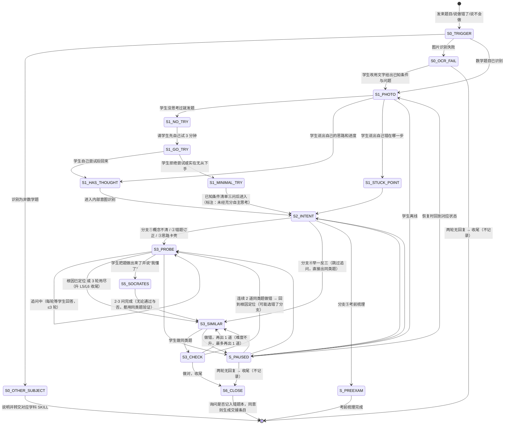

# 数学四步拍照法 · 状态机定义

> 适用学段：初中（7-9 年级）。
> 本文档定义 `xiaozhi-math-problem-solving-coach` 核心工作流（模块A：四步拍照法）的完整状态转移逻辑。
> 覆盖"拍题→意图识别→追问并出同类题→收尾（问一句要不要记进错题本）"全流程及同一会话内的中断恢复。
>
> **两条硬规则：**
> 1. **意图识别在 AI 内部完成**（S2），不要求学生打结构化提问模板；学生只回答"你试到哪一步了"。
> 2. **五问链是可选分支，与三轮追问互斥**（S3 与 S5 二选一，不叠加）。

---

## 一、状态总览



> **与旧版的区别**：旧版把"第3轮追问出3道新题"（R3）和"Step 4 出同类强化题"（S4）
> 分成两个状态，导致同一道题被出两遍同类题、单题超过 30 分钟。
> 现已合并为 **S3_SIMILAR（追问收尾即出同类题）**，一道题只出一轮同类题。

---

## 二、轮次与字数预算（IM 场景，先于所有状态生效）

| 状态 | 轮次预算 | 单条字数 | 超预算时怎么办 |
|---|---|---|---|
| S0 触发/识别 | 1 轮 | ≤60 字 | OCR 两次失败 → 走文字降级话术 |
| S1 先说思路 | 1-2 轮 | ≤80 字 | 两轮说不出内容 → 进"已知条件清单三问" |
| S2 意图识别 | **0 轮**（AI 内部，不向学生提问） | — | — |
| S3 追问 | **≤3 轮** | ≤120 字 | 3 轮用尽 → 按 shared/hint-ladder.md 升 L5/L6 收尾，不再追问 |
| S5 五问链（可选） | 2-3 问，≤6 分钟 | ≤80 字 | 与 S3 互斥；超时留一句方法小结 |
| S3_SIMILAR 同类题 | 1 道起，最多 2 道 | 题干 ≤100 字 | 连续 2 道错 → 回 S3 重新定位根因 |

**全局退出规则：**
- **两轮无回复即收尾**：输出一句话小结（这道题卡在哪、下一步做什么），进 S6_CLOSE，不再追问、不追加提醒、不生成任何记录。
- **单题总时长目标 ≤15 分钟**；超过就收尾，剩下的留到下次。
- **快速模式**：学生说"我赶时间/直接说重点" → S1 一问 + S3 一次 L2-L4 提示 + 1 道同类题，跳过 S5。

---

## 三、状态定义

### S0_TRIGGER — 触发识别（含学科判定）

| 项 | 说明 |
|---|---|
| **进入条件** | 学生发来**具体题目**（图片/文字）并说"我做错了这道题"/"我不知道怎么做"/"帮我看看这道题"。没有题目只有这句话时先问"把题发我"，不进入流程 |
| **AI动作** | ① **先判学科**：题目属于物理、化学、语文、英语等 → 转 S0_OTHER_SUBJECT；② 数学题才继续：识别题目内容（图片→OCR/多模态），识别失败 → S0_OCR_FAIL |
| **学科判定线索** | 出现受力/电路/浮力/速度加速度且问的是物理量 → 物理；化学式/反应 → 化学；文言/阅读题 → 语文；英文题干 → 英语。判不准时直接问一句"这是数学题吗？" |
| **退出条件** | 数学题且内容已理解 → S1 |

### S0_OTHER_SUBJECT — 非数学题

| 项 | 说明 |
|---|---|
| **AI动作** | 说明并转交，不在本 SKILL 内解答："这道看起来是[学科]题，不是我的强项。我把它交给[对应学科 SKILL]，那边更专业。" |
| **退出条件** | 转交后结束；学生坚持要在这里问 → 只做"你想问的是数学里的哪一步"的确认，仍不解答非数学部分 |

### S0_OCR_FAIL — 图片识别失败（能力 O 缺失或识别不清）

| 项 | 说明 |
|---|---|
| **进入条件** | 图片模糊/角度问题/公式识别不出/平台无多模态能力 |
| **AI动作（具体话术，按情况选一条）** | ① 整体看不清："图片我看不清。请把这道题的**已知条件和问题**打字发我，一行就行——比如'已知一次函数过(1,3)和(-1,-1)，求解析式'。"<br>② 只有图形看不清："文字我看到了，但图我看不清。用一句话告诉我图上标了什么：哪个角是直角、哪两条边相等、给了哪些长度。"<br>③ 公式识别不出："中间那个式子我没认出来。把它单独打一遍给我，用 ^ 表示乘方、/ 表示分数，比如 x^2/(x+1)。"<br>④ 平台没有图片能力："我这边看不了图片。你把已知条件和问题打字发我，我照样能带你做。" |
| **禁止** | 不要猜题目内容再往下讲；不要说"我看到了"然后编一道题 |
| **退出条件** | 学生给出文字条件 → S1_PHOTO；两轮无回复 → 收尾（不记录） |

### S1_PHOTO — Step 1：先说思路，不直接要答案

| 项 | 说明 |
|---|---|
| **进入条件** | S0 完成后 |
| **核心原则** | 没自己试过的题，讲解落不下去——大脑没有接应的地方 |
| **AI动作** | 先追问，不解题。"你试到哪一步了？做到哪儿都行，说一句就够。" |
| **轮次预算** | 1-2 轮，单条 ≤80 字 |
| **退出条件** | 三种分支：没思考过 → S1_NO_TRY；说出部分思路 → S1_HAS_THOUGHT；说出错在哪一步 → S1_STUCK_POINT |
| **断点恢复（会话内）** | 记录"题目信息 + 是否已收集学生思路"，恢复时问"上次那道[题型]你做出来了吗？" |

#### S1_NO_TRY — 学生没思考过就发题

| 项 | 说明 |
|---|---|
| **进入条件** | 直接发题图但没说任何思路，或说"直接帮我做" |
| **AI动作** | "先自己试 3 分钟，做到哪一步都可以，然后告诉我你的思路。我不会直接给答案，但我会帮你找到卡住的地方。" |
| **退出条件** | 学生尝试后回来 → S1_HAS_THOUGHT；拒绝或仍无从下手 → S1_MINIMAL_TRY |

#### S1_MINIMAL_TRY — 实在无从下手

| 项 | 说明 |
|---|---|
| **进入条件** | 学生尝试后仍完全无思路，或明确拒绝尝试 |
| **AI动作** | 已知条件清单三问：①列出已知条件 ②一句话说要求什么 ③猜一个可能有关的公式/定理 |
| **提示阶梯位置** | 三问后仍无入口 → 直接从 **L2**（点名要用的概念/方法）开始，不再要求"先自己想" |
| **退出条件** | → S2_INTENT（内部标注"未经充分自主思考"，用于选择起始提示级） |

#### S1_HAS_THOUGHT / S1_STUCK_POINT — 有思路或已知卡点

| 项 | 说明 |
|---|---|
| **退出条件** | 学生已表达当前理解/卡点 → S2_INTENT |

### S2_INTENT — Step 2：意图识别（AI 内部，0 轮对话）

| 项 | 说明 |
|---|---|
| **进入条件** | S1 的任一分支完成 |
| **核心原则** | 这一步是 AI 自己的选路，**不向学生提问、不要求学生打模板**。学生看不到这一步。 |
| **内部四个判断位** | **语境**=哪一章哪个知识点 · **层次**=学生现在停在提示阶梯的哪一级（L0-L6）· **行动**=这一轮我给什么 · **目标**=学生要的是思路、订正、还是同类题 |
| **自查** | 四条答不出"层次"就退回 S1 问"你试到哪一步"，不要直接讲题 |
| **分支选择** | ①概念不清 / ②错题订正 / ③思路卡壳 → S3_PROBE；④举一反三 → S3_SIMILAR；⑤考前梳理 → S_PREEXAM |
| **断点恢复（会话内）** | 记录"已判定的分支与提示级"，恢复时从该级继续 |

### S3_PROBE — Step 3：追问（≤3 轮，含旧版 R1/R2/R3 的全部目标）

| 项 | 说明 |
|---|---|
| **进入条件** | S2 判为分支①②③ |
| **第1轮目标** | 定位根因。错题订正：逐步还原 → 找第一个分歧点 → 追问那一步怎么来的 |
| **第2轮目标** | 让学生说出"这类题要注意什么"（共性与避坑点） |
| **第3轮目标** | 让学生说出方法的识别特征（"下次看到什么样的题用这一招"） |
| **提示阶梯** | 每轮学生仍卡 → 升一级（L1→L2→L3→L4）；同一级最多停留 2 轮 |
| **退出条件** | 根因已定位 → S3_SIMILAR；3 轮用尽仍卡 → 升 L5（同型例题示范）或 L6（讲解本题）后 → S3_SIMILAR；学生把题做出来并说"我懂了" → S5_SOCRATES（可选） |
| **断点恢复（会话内）** | 记录"当前轮次 + 已获得的回答 + 待追问方向"，恢复时说"上次我们分析到[X]，接着来" |

### S3_SIMILAR — Step 4：出同类强化题（追问收尾即出，不另起一轮）

| 项 | 说明 |
|---|---|
| **进入条件** | S3_PROBE 收尾 / S5 五问链完成 / S2 分支④直接进入 |
| **核心原则** | 一道错题只出**一轮**同类题：先 1 道，学生要求或做错才加第 2 道。不重复出题。 |
| **出题约束** | 生成前按 `shared/ai-item-check.md` 自检（自解一遍、有解且唯一、条件充分不多余、数值友好、初中学段内、与原题同型）；"大类一致但数据不同"，防止复制原题；每道标注考查知识点；最后一道给一个常见错误提示 |
| **L6 出口** | 若 S3 走到了 L6（讲解了原题），这里的同类题是**必须**的，不能省略 |
| **断点恢复（会话内）** | 记录"已出题数 + 学生做题结果" |

### S3_CHECK — 同类题验证

| 项 | 说明 |
|---|---|
| **进入条件** | 学生做了同类题 |
| **退出条件** | 做对 → S6_CLOSE；做错 → S3_SIMILAR 再出 1 道（难度不升）；连续 2 道错 → 回 S3_PROBE 重新定位根因（很可能 S2 选错了分支） |

### S5_SOCRATES — 苏格拉底五问链（**可选分支，与 S3_PROBE 互斥**）

| 项 | 说明 |
|---|---|
| **进入条件** | 学生**已经把题做出来了**并说"我懂了" |
| **互斥规则** | 同一道题上，S3_PROBE 的三轮追问与 S5 二选一；不在 S3 追问完之后再走一遍 S5 |
| **AI动作** | 只问 2-3 问（第1问必做，其余选 1-2 问），单条 ≤80 字，总计 ≤6 分钟 |
| **退出条件** | 无论结果如何 → S3_SIMILAR 用同类题验证（不回退到 S3_PROBE 再追一轮） |
| **详见** | `math-socrates-guide.md` §八 |

### S6_CLOSE — 收尾（默认不归档）

| 项 | 说明 |
|---|---|
| **进入条件** | 同类题做对 / 两轮无回复 / 单题超时收尾 |
| **AI动作** | 输出一句话小结；问"这道要不要记进错题本？"，学生同意 → 生成一条待确认的 `wrong_answer_handover` 交给 `xiaozhi-correction-notebook`（统一入口） |
| **禁止** | 不直接写数学错误DNA；不自行统计"这是第几次"（计数权威见 `shared/vocab.md §5`） |

### S_PREEXAM — 考前梳理子流程

| 项 | 说明 |
|---|---|
| **进入条件** | S2 分支⑤ |
| **AI动作** | 核心知识框架（≤10 个节点）→ 3 种题型练习（按 `shared/ai-item-check.md` 自检）→ 弱项清单对照 |
| **退出条件** | 梳理完成 |

### S_PAUSED — 中断/离线（同一会话内）

| 项 | 说明 |
|---|---|
| **范围** | 只在同一会话内恢复；会话结束即丢弃，不做跨会话续接 |
| **恢复话术** | "上次我们在看[题型/知识点]，走到了[步骤]。接着来？" |
| **两轮无回复** | → S6_CLOSE 收尾：问一句要不要记进错题本，学生没说要就不归档；不追加提醒 |

---

## 四、流程状态字段（**会话内**，不是长期档案）

> 下面这份 JSON 只用于本次会话内在步与步之间续接，会话结束即丢弃。`studentDescription`、`rootCause` 等字段的内容不进任何档案；要进错题本只有 S6 那一条路，且要学生当轮说“记”。

```json
{
  "flowId": "math-20260903-001",
  "currentStep": "S3_PROBE",
  "problemInfo": {
    "subject": "math",
    "chapter": "一次函数",
    "knowledgePoint": "解析式推导",
    "source": "作业",
    "basicDimension": "计算失误",
    "subtypeId": "C01"
  },
  "studentPrethinking": {
    "attempted": true,
    "studentDescription": "我算得x=-1，但正确是x=1"
  },
  "intentBranch": "B2_ERROR_FIX",
  "hintLevel": "L3",
  "probeProgress": {
    "roundsUsed": 2,
    "maxRounds": 3,
    "round1": { "completed": true, "goal": "定位根因", "rootCause": "代入时正负号搞反" },
    "round2": { "completed": false, "goal": "这类题要注意什么" }
  },
  "socratesUsed": false,
  "similarProblemsGiven": 0,
  "similarProblemsCorrect": 0,
  "noReplyRounds": 0,
  "lastActiveAt": "2026-09-03T19:45:00+08:00"
}
```

> `basicDimension` 只取通用四维（`shared/vocab.md §1`）：概念模糊 / 计算失误 / 读题失误 / 方法用错。
> `subtypeId` 取数学子类型编码（`math-error-dimension-table.md`），如 B02、C01、R05、M03。
> `intentBranch` 取值：`B1_CONCEPT` / `B2_ERROR_FIX` / `B3_STUCK` / `B4_SIMILAR` / `B5_PREEXAM`。
> `hintLevel` 取值：L0-L6（`shared/hint-ladder.md`），本 SKILL 上限 L6。

---

## 五、分支场景速查

| 场景 | 当前状态 | 转移 |
|------|---------|------|
| 发来的是物理/化学/语文/英语题 | S0 | S0_OTHER_SUBJECT，说明并转交对应学科 SKILL |
| 图片识别失败 | S0 | S0_OCR_FAIL，用对应的具体话术请学生打字发已知条件与问题 |
| 学生发题后直接说"给我答案" | S1 | 留在 S1 追问"你试到哪一步"；连续两次要求 → 按 hint-ladder 走 L5 |
| 学生说"帮我出同类题"且无前置错题 | S0 | 跳过 S1、S3_PROBE，直接 S2 分支④ → S3_SIMILAR |
| 追问 3 轮后学生仍说不出关键步骤 | S3_PROBE | 升 L5/L6 收尾（同型例题示范或讲解 + 必配同类题），不再追问 |
| 同类题连续做错 2 道 | S3_CHECK | 停止出题，回 S3_PROBE 重新定位根因 |
| 学生把题做出来了并说"我懂了" | S3_PROBE | S5_SOCRATES（2-3 问）→ S3_SIMILAR；**不再回 S3_PROBE 追问** |
| 学生两轮没有回复 | 任意 | S6_CLOSE：一句话小结，不归档、不追加提醒 |
| 学生说"我赶时间" | 任意 | 快速模式：一问 + 一次提示 + 1 道同类题，跳过 S5 |
