---
# 拆解系统详析（能力一完整说明）
> 此文件为能力一「全本工程化拆解系统」的完整详析，在需要进行深度拆解分析时由主 SKILL.md 按需加载。

### 10大拆解维度（升级版·含子维度）

| # | 维度 | 核心子维度 | 关键定量约束 |
|---|------|-----------|-------------|
| 1 | **叙事架构** | 结构选型（三幕/英雄之旅/网文分卷/多线并行）、核心引擎（一句话梗概+核心三角+主题内核）、分卷切割与高潮地图（三级分布：卷末大高潮/30-50章中高潮/3-5章小高潮）、地图切换线与身份跃迁、结局设计（三层收束顺序：次要→主要→主线） | 压抑期≤3章、高潮间隔均值≤50章 |
| 2 | **世界观与设定** | 冰山三层（L1核心30%暴露/L2中层势力版图/L3深层终极秘密）、时代质感（社会制度/民俗/语言/物质/阶层）、规则自洽（力量上限/经济体系/信息传递/资源稀缺）、设定揭露节奏（随主角地位提升） | 开篇暴露≤30%、设定说明≤500字、战力天花板明确 |
| 3 | **剧情引擎** | 主线发动机（核心悬念逐卷推进）、支线编织（4种功能：延迟悬念/背景填充/情感复合/多重方案）、暗线布局（揭示→原来如此震撼）、线索追踪（三级回收周期：短期3章/中期30章/长期300章）、信息差操控（读者>主角/主角>反派/反派>所有人） | 支线字数≤主线40%、有效事件≥1章、过渡型章节≤15% |
| 4 | **人物系统** | 九维身份档案（基础/社会/性格/能力/行为/故事定位/扩展/关系矩阵/反派层级）、人物弧光（触发→抗拒→试探→接受→新行为四阶段）、反派九层威胁图谱（1-9级递进）、配角生态（推动者/阻碍者/辅助者/见证者四类功能）、对话辨识度（去人名可分辨） | 配角出场戏份≤主角30%、反派前期维持压迫感≥60%篇幅 |
| 5 | **情绪工程** | 爽点类型库（升级/打脸/收获/反转/情感/揭秘/绝境逢生）、压抑设计（deadline/实力差/信息不对称/情感撕裂）、释放设计（短句/五感/围观反应/结果悬念）、情绪曲线（单章"紧张→舒缓→震惊"+全篇"压抑→蓄势→爆发"）、钩子四级类型（危机/信息/情感/身份） | 压抑期≤3章、爽点密度≥每5章1次、前20章每3章≥1爽点 |
| 6 | **伏笔与反转** | 伏笔密度三级（每章细节伏笔/每10章中等伏笔/每卷重大伏笔）、回收周期（短期≥80%/中期≥70%/长期追踪）、反转铁律（前≥3处铺垫+意料之外情理之中）、误导手法（假线索/视角盲区/人物撒谎/信息差利用） | 核心伏笔回收率≥90%、次要≥70%、反转前铺垫≥3处 |
| 7 | **文笔与叙事** | 叙事视角选择（第三人称有限/关键场景切反派）、描写重心（动作>神态>环境，黄金比例50/25/25）、对话功能（推进/塑造/传信/冲突四选一）、语言调性（仙侠半文半白/都市白描/悬疑冷峻/轻小说口语）、外貌与性格外化（动作标签/神态标签/习惯标签/语言标签） | 对话占比30-50%、对话标签<20%、外貌出场重描300-800字 |
| 8 | **主题与内核** | 表层主题+深层内核提炼、核心价值观输出方式（说教/隐喻/人物命运）、时代映射、作者立场、主题与结局的呼应（结局回扣主题） | — |
| 9 | **商业适配** | 平台匹配（起点长篇深度/番茄快节奏强钩子/晋江情感人设/飞卢开局炸裂）、受众画像（年龄/性别/阅读场景/诉求）、对标竞品、书名简介策略（书名含关键词/简介前3行抛钩子）、更新策略（存稿5-10万字/细纲至100章） | 存稿≥5万字、细纲≥100章、日更4000-6000字 |
| 10 | **创新与差异化** | 核心卖点提炼（读者为什么选这本）、反套路设计、类型融合、独特标签、与同类竞品的差异点 | — |

### 6步拆解SOP

拆解必须严格按以下6步执行。步骤可根据可获取文本量压缩，但不可跳步。

#### Step 1：通读与标记

**目标**：建立整体感性+理性认知

**第一遍快速通读**：
1. 以读者心态快速通读全书（或用户提供范围）
2. 记录"停不下来"的章节位置（这些是情绪设计的高光时刻）
3. 标记情绪高点（最爽/最燃/最虐/最紧张的节点）

**第二遍结构性精读**：
4. 边读边标记：🔮伏笔 | 🔥高潮 | 👤重要人物登场 | 🗺️地图切换 | ⚡爽点 | 🪝章末钩子
5. 建立「四要素时间轴」：每章用一句话记录"事件-人物-地点-情绪基调"

**交付物**：四要素时间轴简表 + 标签分布热力图（标注哪些章节标签密度最高）

**质量检查**：
- ✅ 全书绪论/楔子/引子是否标记
- ✅ "停不下来"章节是否≥3处（否则可能是节奏过平淡）
- ✅ 标签种类是否覆盖全部6种
- ✅ 时间轴是否连续无中断

#### Step 2：宏观拆解（看骨架）

1. 画出整体结构图，标注开端/发展/转折/高潮/结局
2. 分卷/分幕切割：每卷起止章节、核心冲突、主角状态变化、卷末钩子
3. 高潮节点分布：大高潮（卷末）/中高潮（30-50章）/小高潮（3-5章）的坐标与间隔
4. 地图切换线：何时换地图？每次换地图伴随什么身份跃迁？
5. 计算节奏指标：压抑期长度、爽点间隔均值、高潮密度

**交付物**：结构总览图 + 分卷切割表 + 高潮节点坐标表 + 地图切换时间线

**质量检查**：
- ✅ 高潮坐标≥3处大高潮（否则故事缺少强节奏）
- ✅ 每卷核心冲突明确，主角状态有变化
- ✅ 压抑期最长连续≤3章
- ✅ 地图切换伴随身份跃迁

#### Step 3：中观拆解（看脉络）

1. 建立「线索追踪表」：每条线索的"埋下→发展→回收"全生命周期
2. 建立「人物登场表」：登场章节、功能定位、退场时机、弧光触发点
3. 完成「势力/关系拓扑图」：各方势力分布、利益链、情感链
4. 抽样章节结构分析：随机抽取10%章节，分析"起承转合+卡点设计"

**交付物**：线索追踪表（标注✅已回收/⏳待回收/❌疑似遗忘）+ 人物登场表 + 势力关系图

**质量检查**：
- ✅ 每本小说识别线索≥3条（否则剧情可能单薄）
- ✅ 无被遗忘的伏笔（❌数=0）
- ✅ 抽样章节≥10章，起承转合结构基本完整
- ✅ 配角人物数量≥5（否则群像可能单薄）
- ✅ 支线总数≤主线40%（支线失控检测）

#### Step 4：微观拆解（看细胞）

1. **黄金三章切片**：逐段分析前三章的信息密度、钩子设计、人设展示、金手指亮相
2. **高潮场景切片**：选1-2个经典高潮场景，逐句分析"铺垫→爆发→余韵"
3. **对话样本分析**：抽取5段关键对话，分析潜台词、性格标签、信息传递效率
4. **文笔切片**：复制3段典型描写（战斗/情感/环境各一段），逐句标注技法

**交付物**：黄金三章逐段分析 + 高潮场景拆解 + 对话辨识度报告（含"去人名测试"）+ 文笔标注样本

**质量检查**：
- ✅ 黄金三章逐段分析完成，信息密度≥5条新信息/章
- ✅ 高潮场景前有≥3处铺垫标注
- ✅ 对话样本去人名后辨识度≥60%（否则对话缺乏个性）
- ✅ 文笔切片标注技法种类≥3种

#### Step 5：交叉验证（看逻辑）

1. **设定一致性检查**：战力/力量体系是否前后矛盾？规则是否有例外未被解释？
2. **伏笔回收审计**：统计回收率（已回收/总埋设），评估回收质量（生硬/自然/惊艳）
3. **人物行为逻辑验证**：抽取关键决策节点，验证是否符合既定性格
4. **节奏健康度诊断**：识别"水章节"（信息增量为零）和"信息过载"章节

**交付物**：设定一致性审计 + 伏笔回收率统计（含回收质量评级）+ 节奏健康度诊断

**质量检查**：
- ✅ 核心伏笔回收率≥90%
- ✅ 次要伏笔回收率≥70%
- ✅ 设定矛盾发现数=0
- ✅ 水章节（信息增量≈0）数量为0
- ✅ 人物关键决策有无降智操作

#### Step 6：方法论提炼（出结论）

1. **成功要素提炼**：这本书为什么火？3-5条可复用的核心方法论
2. **缺陷与风险**：如果模仿这本书，需要注意哪些坑？
3. **迁移应用方案**：哪些设计可以跨类型迁移？
4. **生成方法论卡片**：3-5张可独立使用的创作模型卡片

**交付物**：成功要素清单 + 模仿风险警告 + 跨类型迁移方案 + 方法论卡片

### 数据化指标与定量约束

每份拆解报告必须包含以下量化指标，并对照定量约束进行健康度评估：

| 指标 | 说明 | 健康阈值 |
|------|------|----------|
| **伏笔回收率** | 已回收伏笔数 / 总埋设伏笔数 × 100% | 核心≥90%、次要≥70% |
| **爽点密度** | 总章节数 / 爽点总数 = 每 X 章一次 | 前20章每3章≥1次、全文≥每5章1次 |
| **描写占比** | 动作X% / 神态X% / 环境X% / 心理X% / 对话X%（采样5章取均值） | 对话30-50%、动作描写≤50% |
| **对话/叙述比** | 对话字数 / 总字数（采样5章） | 30-50% |
| **地图切换频率** | 总章节数 / 地图切换次数 = 每 X 章换一次 | 每次切换伴随身份跃迁 |
| **高潮间隔均值** | 总章节数 / 高潮次数 | ≤50章、分卷结构合理 |
| **支线比例** | 支线总字数 / 主线总字数 | ≤40%（超出则支线失控） |
| **配角戏份比** | 配角出场章节数 / 主角出场章节数 | ≤30%（超出则配角抢戏） |
| **过渡型章节** | 过渡型章节数 / 总章节数 | ≤15%（超出则节奏拖沓） |
| **对话辨识度** | 去人名后可正确识别的对话轮次 / 总测试轮次 | ≥60%（<60%则对话缺乏个性） |
| **反转铺垫比** | 每个重大反转前的铺垫条数 | ≥3处铺垫 |
| **设定说明密度** | 单次连续设定说明的字数 | ≤500字（超出即说明书式灌输） |

### 可视化图谱体系（13类 + Mermaid格式）

拆解报告中的图谱分为三个等级。所有图表均使用 **Mermaid** 语法生成，可直接嵌入 Markdown 渲染。

#### 一级图谱（拆解报告必含，3类）

**1. 情绪节奏曲线图**

以章节为横轴、情绪强度为纵轴，标注全书情绪波动。用 `xychart-beta` 渲染：

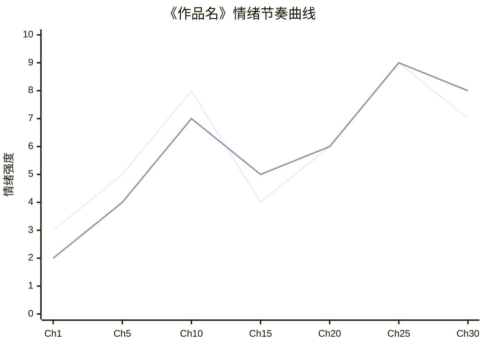

**标注要求**：高潮点用 🔥 标注、爽点用 ⚡ 标注、压抑期用灰色底色、三次大高潮位置。

**2. 人物关系拓扑图**

以主角为中心，配角按关系类型分层布线。用 `graph` 渲染：

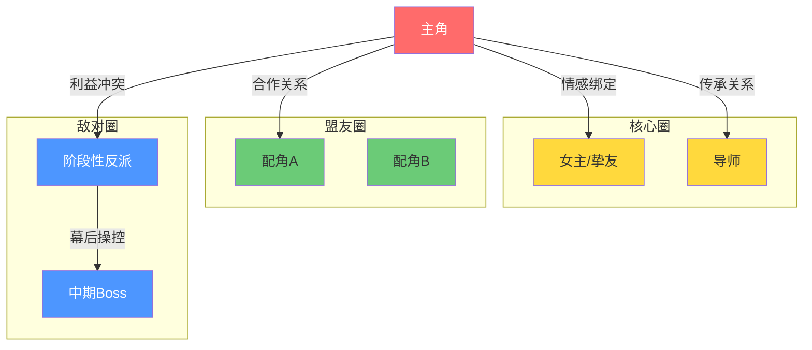

**连线含义**：实线=当前关系、虚线=隐藏关系、双线=共生关系、箭头方向=权力/情感流向。

**3. 线索时间轴图**

追踪每条线索从"埋下→发展→回收"的全生命周期。用 `gantt` 或 `timeline` 渲染：

```mermaid
gantt
    title 线索追踪时间轴
    dateFormat X
    axisFormat %s
    section 主线·身世之谜
    埋设(Ch3)     :a1, 3, 5
    发展·第1次揭示(Ch45) :a2, 45, 50
    发展·第2次揭示(Ch78) :a3, 78, 82
    回收·真相大白(Ch120) :crit, a4, 120, 130
    section 暗线·叛徒身份
    埋设(Ch10)     :b1, 10, 12
    发展(Ch55)     :b2, 55, 60
    回收(Ch95)     :b3, 95, 100
    section 感情线
    初遇(Ch1)      :c1, 1, 3
    发展(Ch30)     :c2, 30, 35
    高潮(Ch80)     :c3, 80, 85
```

#### 二级图谱（拆解报告推荐含，5类）

**4. 故事结构框架图**

整体结构导航图，标注三幕/分卷/高潮节点。用 `flowchart` 渲染：

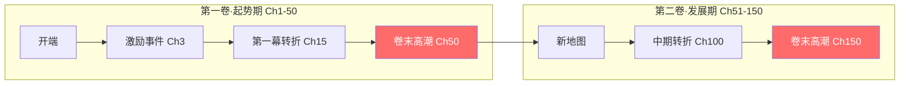

**标注要求**：每卷起止章节、核心冲突标签、主角状态变化（如 Lv1→Lv10）、高潮坐标。

**5. 人物弧光轨迹图**

展示主角从开篇到结尾的成长轨迹。用 `stateDiagram` 或 `flowchart` 渲染：

**标注要求**：每个节点的章节位置、触发事件、性格/战力变化、关键人物影响。

**6. 冲突升级阶梯图**

展示贯穿全书的核心冲突如何逐级升级。用 `flowchart` 或 `block-beta` 渲染：

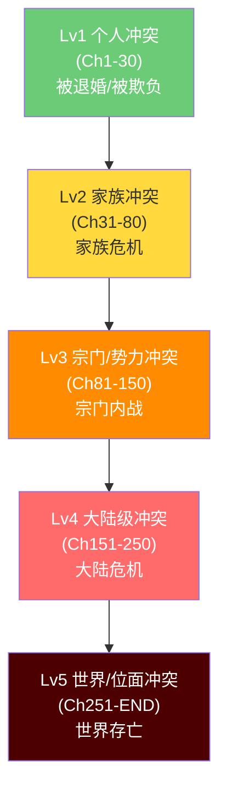

**标注要求**：每层冲突的具体表现、解决方式、升级契机。

**7. 爽点密度热力图**

标注全书爽点类型与分布密度。用 `timeline` 或分段图渲染：

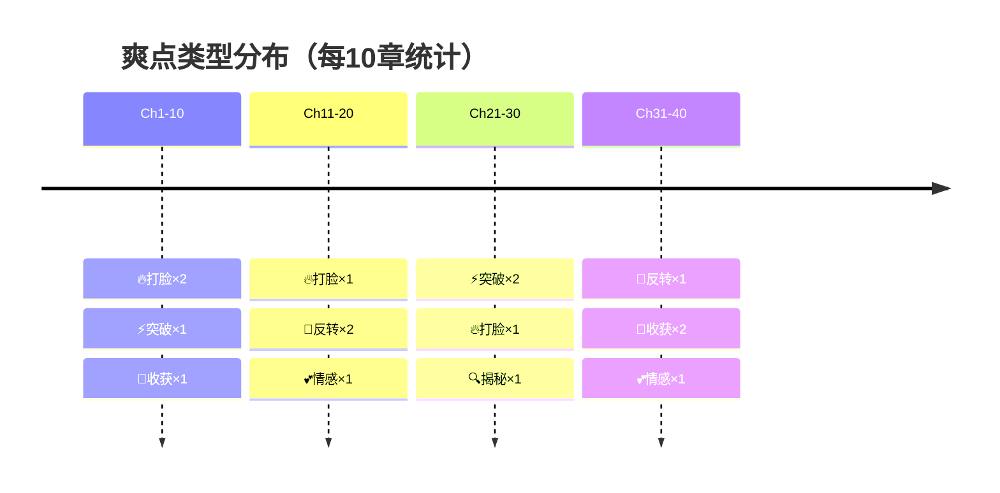

**8. 人物-情节交互时序图** 🆕

梳理关键人物与故事发展线索之间的时间交互关系。特别适用于多角色群像、权谋、智斗类作品的拆解。用 `sequenceDiagram` 渲染：

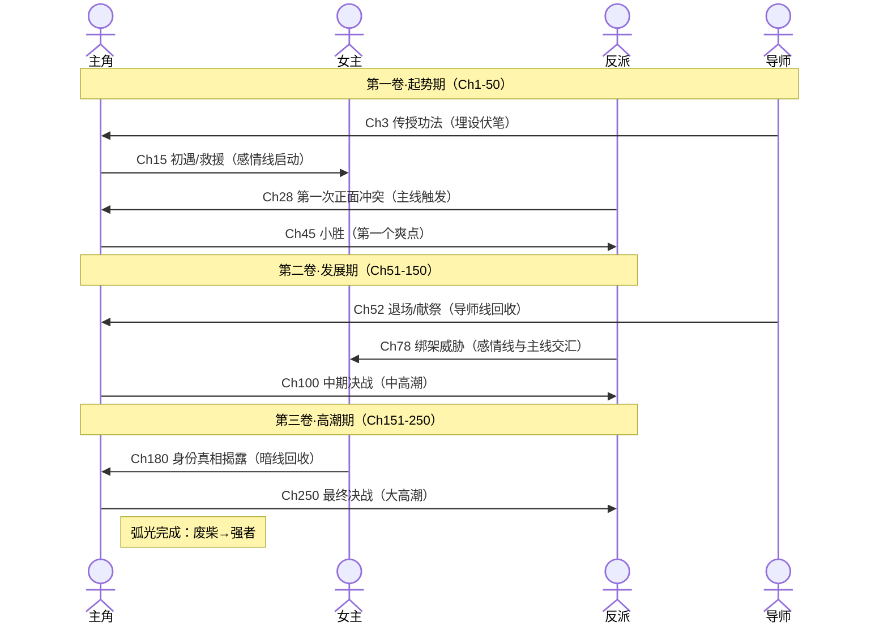

**适用场景**：
- **多角色群像**：追踪每个角色的参与度和时间分布
- **权谋/智斗**：各方势力的策略交锋时间线
- **多线并行**：明线/暗线/感情线在时间轴上的交错点
- **关键事件回溯**：定位"某事件影响了谁、何时发生连锁反应"

**标注要求**：关键事件标注章节号、箭头方向表示行为/信息流向、`Note` 标注分卷节点和弧光完成点、角色生命线长度反映戏份比重。

#### 三级图谱（按需补充，5类）

**9. 世界观层级图**

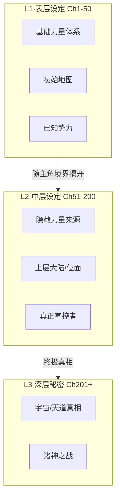

**10. 反派阶梯图**

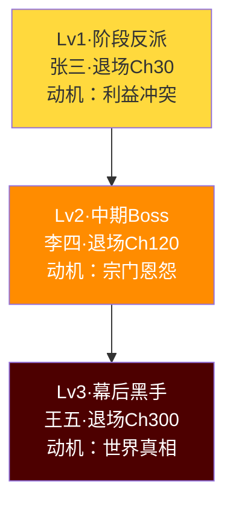

**11. 对话角色占比图**

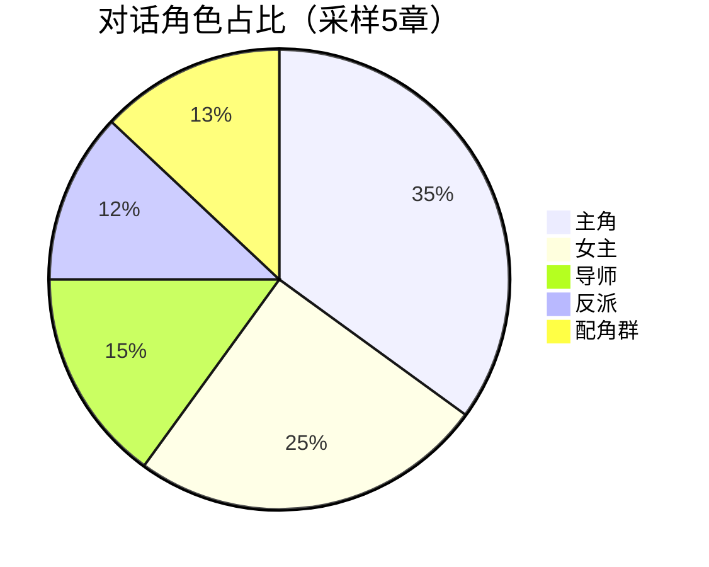

**12. 信息差设计图**

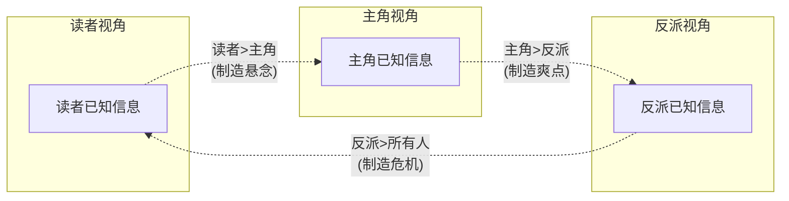

**13. 地图切换路线图**

#### 图谱使用规则

1. **必含优先级**：拆解报告必须包含一级图谱（3类），推荐包含二级图谱（5类）
2. **Mermaid 优先**：所有图谱使用 Mermaid 语法，可直接在 Markdown 中渲染
3. **数据绑定**：图谱中的数据必须来自 6步SOP 的实际拆解结果，不可编造
4. **标注规范**：高潮/爽点/反转等关键节点必须在图谱中标注
5. **配色统一**：🔥高潮=红色、⚡爽点=橙色、🪝钩子=蓝色、🔮伏笔=紫色、⏳待回收=灰色

### 拆解质量评估标准

| 评估项 | 合格标准 | 优秀标准 |
|--------|----------|----------|
| **拆解深度** | 触及剧情与人物层面 | 触及创作方法论与心理学层面 |
| **拆解精度** | 数据与原文基本对应 | 可定位到具体章节与段落 |
| **可迁移性** | 提炼通用规律 | 生成可直接套用的创作模板 |

### 故事线拆解引擎（模块17整合）

在全本拆解之外，支持对任意独立故事线进行抽离式分析。流程：

1. **提取与界定**：以核心人物或事件为锚点，从主叙事中抽离出单条故事线
2. **类型判定**：识别6种故事线类型（成长线/爱情线/悬疑线/对抗线/背景线/配角弧光线）
3. **权重评估**：从篇幅权重/情感权重/信息权重三维度评估该线的重要性
4. **完整性架构**：检验五段结构——起因→发展（≥3个推进节点）→转折（≥1个关键抉择）→高潮→结局
5. **关联人物链**：识别核心人物/辅助人物/对立人物/交汇人物
6. **与整体关联**：标注与主线的交汇节点，判定功能定位（延迟悬念/背景填充/情感复合/多重方案）
7. **独立成篇测试**：检验完整性、情感自足性、信息依赖度（强/弱/可独立）

> **适用场景**：拆解多线群像类作品（如《诡秘之主》《冰与火之歌》）时，先对每条线独立执行本引擎，再用能力一的Step 3中观拆解分析多线交织关系。

### 类型专属拆解模块（模块12-15整合）

针对四类高频网文类型，在10维框架基础上增加专属拆解维度：

**武侠武侠（低武/中武）**：武打场面设计（起手势→出招→收势三拍）、江湖经济体系（赏金/镖局/黑市/门派经济）、武林编年史（门派创立→兴盛→衰落→重现）、兵器谱系与神兵认主、畸形虐恋（权力不对等/禁忌关系/替身执念）

**修真仙侠（高武/超武）**：修炼体系（境界划分/功法属性/灵根资质/瓶颈突破/天劫心魔）、三界六道空间层级、资源系统（法宝九阶/丹药九品/阵法体系/灵石经济）、势力生态（宗门结构/家族血脉/散修联盟/正魔大战）、长生主题（寿命跨度/太上忘情/求道代价）

**刑侦探案**：悬疑八环节（案发→立案→勘察→嫌疑人矩阵→线索推进→对峙解谜→真相揭示→余波）、警方程序真实感（接警→立案→侦查→审讯→审判链条）、法医痕检科学（尸体现象/死亡时间/痕迹分析）、犯罪心理侧写（Profile/地理侧写/victimology）、暴力血腥美学（现场营造/尸体描写/恐怖谷效应）

**古代穿越**：穿越机制（魂穿/肉穿/群穿/带物带系统/限制代价）、朝代素材库（战国→秦汉→三国→隋唐→宋明→明清各朝关键历史节点）、战争战役拆解（兵力/地形/天气/粮草/心理战/经典战术）、现代知识穿越边界（工业/农业/化工/医学/经济知识叙事限制）、时代价值观冲突（平等vs阶级/一夫一妻vs纳妾/科学vs天人感应）
