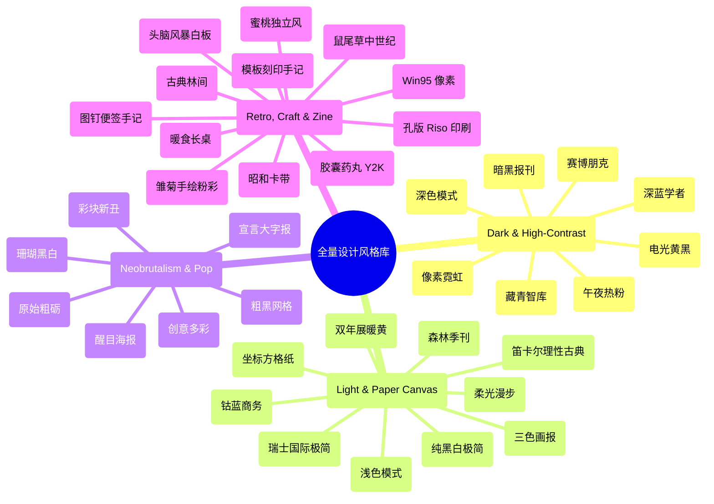

# 🎨 全量设计风格与 Presets 图鉴 (Style Gallery)

本项目内置了 **37 款独立设计系统规范**（包含 35 套 Bold Template Pack 模版及经典核心预设）。每一套风格均经过严格的视觉排版调优与色彩校验，拒绝千篇一律的 “AI 塑料感 (AI Slop)”。

本图鉴为您提供所有风格的 **1:1 视觉预览、调性属性、适用场景、色彩色板、字体搭配与设计签名特征**，帮助您在商业路演、技术分享、学术汇报或创意展示中快速找到最契合的视觉语言。

---

## 🧭 风格分类导航 (Category Fast Track)



---

## 📊 全量风格速查矩阵 (Full Styles Table)

| 预览 (Preview) | 风格名称 (Slug) | 视觉基调 (Vibe) | 最佳适用场景 (Best For) | 色彩基调 & 核心字体 | 规范链接 |
| :---: | :--- | :--- | :--- | :--- | :---: |
|  | **Beautiful Modern**<br>`beautiful-modern` | 优雅、现代、流体玻璃态 | 商业路演、产品发布、AI 产品介绍 | 冰蓝 / 紫霓虹 / 磨砂黑白<br>`Plus Jakarta Sans` | [规范](bold-template-pack/templates/beautiful-modern/design.md) |
|  | **Swiss International**<br>`swiss-international` | 严谨、理性、包豪斯网格 | 架构设计、学术汇报、系统工程 | 纯白 / 纯黑 / 国际红<br>`Helvetica / Archivo` | [模版](../resources/template-swiss.html) |
|  | **Cyberpunk Dark**<br>`cyberpunk-dark` | 霓虹发光、黑客极客感 | 技术分享、开源路演、硬核架构 | 纯黑 / 青绿发光 / 霓虹粉<br>`JetBrains Mono` | [模版](../resources/template.html) |
|  | **8-Bit Orbit**<br>`8-bit-orbit` | 像素怀旧、街机游戏、CRT | 独立开发工具、游戏展、Web3 | 深空蓝 / 荧光绿 / 像素黄<br>`Tektur / Space Mono` | [规范](bold-template-pack/templates/8-bit-orbit/design.md) |
|  | **Biennale Yellow**<br>`biennale-yellow` | 欧洲双年展、艺术海报、沉静 | 美术馆年刊、设计展演、文化出版 | 暖羊皮纸 / 太阳黄 / 靛蓝<br>`Instrument Serif` | [规范](bold-template-pack/templates/biennale-yellow/design.md) |
|  | **BlockFrame**<br>`block-frame` | 粗黑框、马卡龙多色、新丑风 | 独立 SaaS 发布、创意机构提案 | 荧光薄荷 / 嫩紫 / 暖橙<br>`Plus Jakarta Sans` | [规范](bold-template-pack/templates/block-frame/design.md) |
|  | **Blue Professional**<br>`blue-professional` | 现代商务、电光钴蓝、严谨 | B2B SaaS 路演、战略咨询汇报 | 米白纸底 / 钴蓝 `#0047FF`<br>`Manrope` | [规范](bold-template-pack/templates/blue-professional/design.md) |
|  | **Bold Poster**<br>`bold-poster` | 大号粗衬线、单点烈红、海报感 | 品牌宣言、创始人演说、封面杂志 | 象牙白 / 烈火红 `#E63946`<br>`Shrikhand / Serif` | [规范](bold-template-pack/templates/bold-poster/design.md) |
|  | **Broadside**<br>`broadside` | 纯黑底、烈火橙、大字报张力 | 双语设计演说、激进技术宣言 | 纯黑底 / 烈火橙 `#FF5500`<br>`Grotesk / Serif` | [规范](bold-template-pack/templates/broadside/design.md) |
|  | **Capsule**<br>`capsule` | 胶囊药丸、糖果马卡龙、Y2K | 创作者作品集、DTC 消费品牌 | 骨白底 / 薄荷绿 / 柔粉<br>`Plus Jakarta Sans` | [规范](bold-template-pack/templates/capsule/design.md) |
|  | **Cartesian**<br>`cartesian` | 笛卡尔理性、大留白、古典 | 投资哲学论文、智库报告、文化深度 | 暖棉纸白 / 经典碳墨黑<br>`Playfair Display` | [规范](bold-template-pack/templates/cartesian/design.md) |
|  | **Cobalt Grid**<br>`cobalt-grid` | 坐标方格纸、像素阶梯、研讨 | 建筑设计公报、学术论文摘要 | 方格坐标纹理 / 电光钴蓝<br>`Modernist Serif` | [规范](bold-template-pack/templates/cobalt-grid/design.md) |
|  | **Coral**<br>`coral` | 炭黑底色、珊瑚粉橙、时尚杂志 | 时尚品牌、创作者作品、健身美妆 | 炭黑 `#1A1A1A` / 珊瑚粉橙<br>`Bebas Neue` | [规范](bold-template-pack/templates/coral/design.md) |
|  | **Creative Mode**<br>`creative-mode` | 多彩多色块、粗黑展示、自信 | 创意机构提案、设计评审、艺术指导 | 暖纸底 / 绿 / 粉 / 橙 / 黄<br>`Archivo Black` | [规范](bold-template-pack/templates/creative-mode/design.md) |
|  | **Daisy Days**<br>`daisy-days` | 雏菊物语、手绘涂鸦、温暖柔和 | 教育培训、亲子生活、社群工作坊 | 柔粉彩 / 暖阳黄 / 婴儿蓝<br>`Friendly Rounded` | [规范](bold-template-pack/templates/daisy-days/design.md) |
|  | **Editorial Forest**<br>`editorial-forest` | 森林墨绿、烟粉暖米、季刊慢读 | 绿色可持续、企业季度复盘、书籍发布 | 墨绿 `#1B4332` / 烟粉 / 暖米<br>`Source Serif 4` | [规范](bold-template-pack/templates/editorial-forest/design.md) |
|  | **Editorial Tri-Tone**<br>`editorial-tri-tone` | 勃艮第红、干枯玫瑰粉、时装大片 | 时尚画报、艺术指导、高端品牌展 | 勃艮第深红 / 玫瑰粉 / 芥末黄<br>`Bricolage Grotesque` | [规范](bold-template-pack/templates/editorial-tri-tone/design.md) |
|  | **Emerald Editorial**<br>`emerald-editorial` | 祖母绿、金色双线、杂志封面 | 领导力汇报、高端商业策划案 | 祖母绿 `#0F3A2F` / 雅金色<br>`Bodoni Moda / Serif` | [规范](bold-template-pack/templates/emerald-editorial/design.md) |
|  | **Grove**<br>`grove` | 典雅林间、深绿米白、古典有机 | 生态农业、精品酒庄、双语报告 | 森林暗绿 `#162B1D` / 铁锈红<br>`Playfair Display` | [规范](bold-template-pack/templates/grove/design.md) |
|  | **Long Table**<br>`long-table` | 暖食长桌、锈红暖米、烟火社交 | 餐饮烘焙、餐酒会、社群活动 | 暖米底 / 锈红 `#C84B31`<br>`Fraunces` | [规范](bold-template-pack/templates/long-table/design.md) |
|  | **Mat**<br>`mat` | 鼠尾草暗绿、焦橙色、中世纪现代 | 家具家居、手工艺品牌、建筑设计 | 哑光深鼠尾草 `#2E3830` / 焦橙<br>`Lora / Sans` | [规范](bold-template-pack/templates/mat/design.md) |
|  | **Monochrome**<br>`monochrome` | 纯黑纯白、无彩色、手排账本 | 用户调研综述、白皮书、政策文件 | 纯象牙白 / 纯黑墨印<br>`Lora / Jost` | [规范](bold-template-pack/templates/monochrome/design.md) |
|  | **Neo-Grid Bold**<br>`neo-grid-bold` | 新丑粗框、荧光黄点缀、硬核 | 潮流品牌、技术沙龙、数据流展示 | 纯白纸底 / 荧光黄 / 粗黑线<br>`Archivo Black` | [规范](bold-template-pack/templates/neo-grid-bold/design.md) |
|  | **People's Platform**<br>`peoples-platform` | 宣言大字报、红蓝黄撞色、直率有力 | 社区行动倡议、文化评论、团队动员 | 经典海报蓝 / 亮红 / 暖黄<br>`Alfa Slab One / Caveat` | [规范](bold-template-pack/templates/peoples-platform/design.md) |
|  | **Pin & Paper**<br>`pin-and-paper` | 图钉便签、网格黄纸、手写笔迹 | 深度用户访谈、调研笔记、团队复盘 | 泛黄牛皮纸 / 墨水蓝 / 珊瑚橙<br>`Caveat / Space Mono` | [规范](bold-template-pack/templates/pin-and-paper/design.md) |
|  | **Pink Script**<br>`pink-script` | 午夜热粉、高冷衬线、奢华夜色 | 夜间沙龙、烈酒发布、高端时尚晚宴 | 曜石纯黑 `#09090C` / 霓虹热粉<br>`Instrument Serif` | [规范](bold-template-pack/templates/pink-script/design.md) |
|  | **Playful**<br>`playful` | 暖阳蜜桃、现代无衬线、轻松明快 | 独立开发者发布、社群早报、播客 | 暖蜜桃 `#FFE8DF` / 珊瑚红<br>`Syne` | [规范](bold-template-pack/templates/playful/design.md) |
|  | **Raw Grid**<br>`raw-grid` | 原始粗砺黑边、偏移硬阴影 | 创业孵化路演、快节奏 Demo Day | 粗纸白 / 粉紫色块 / 4px 黑框<br>`Plus Jakarta Sans` | [规范](bold-template-pack/templates/raw-grid/design.md) |
|  | **Retro Windows**<br>`retro-windows` | 经典 Win95 灰、3D 凹凸立体框 | 科技考古、极客复古、趣味技术演进 | 经典蓝绿桌面 / 灰标题栏<br>`MS Sans Serif / Pixel` | [规范](bold-template-pack/templates/retro-windows/design.md) |
|  | **Retro Zine**<br>`retro-zine` | 孔版印刷 Riso、大字报印章 | 独立音乐厂牌、地下艺术、手作发布 | 粗糙米纸 / 松针绿 / 陶土红<br>`Bebas Neue / Caveat` | [规范](bold-template-pack/templates/retro-zine/design.md) |
|  | **Sakura Chroma**<br>`sakura-chroma` | 昭和卡带彩虹带、日系硬核参数 | 独立硬件产品手册、音乐厂牌排期 | 暖白底 / 五彩斜带 / 纯黑大字<br>`Space Mono / Bold Sans` | [规范](bold-template-pack/templates/sakura-chroma/design.md) |
|  | **Scatterbrain**<br>`scatterbrain` | 头脑风暴点阵白板、多彩贴纸微斜 | 敏捷 Sprint 复盘、设计思维工作坊 | 点阵白板 / 糖果贴纸黄色粉色<br>`Zilla Slab / Caveat` | [规范](bold-template-pack/templates/scatterbrain/design.md) |
|  | **Signal**<br>`signal` | 藏青深邃、哑光真金、权威智库 | 董事会报告、宏观经济白皮书、法律 | 深藏青 `#0B192C` / 哑光真金<br>`Cinzel / Bold Sans` | [规范](bold-template-pack/templates/signal/design.md) |
|  | **Soft Editorial**<br>`soft-editorial` | 柔光周刊、晨雾灰绿、舒缓留白 | 艺术随笔、生活方式媒体、个人专栏 | 柔米白 / 灰绿 `#6B705C` / 浅柠黄<br>`Cormorant Garamond` | [规范](bold-template-pack/templates/soft-editorial/design.md) |
|  | **Stencil & Tablet**<br>`stencil-tablet` | 模板刻印、大地陶土、田野考古手记 | 文化遗产展、建筑田野考察、历史特展 | 骨白纸基 / 赭石土黄 / 赤陶红<br>`Space Mono / Heavy Stencil` | [规范](bold-template-pack/templates/stencil-tablet/design.md) |
|  | **Studio**<br>`studio` | 纯黑底、高压电光黄、极简张力 | 顶级创意工作室提案、潮流服饰发布 | 纯黑 `#0A0A0A` / 电光黄 `#FAFF00`<br>`Archivo Black` | [规范](bold-template-pack/templates/studio/design.md) |
|  | **Vellum**<br>`vellum` | 羊皮手抄学府、深海蓝金、宁静哲理 | 理论物理、拓扑数学、古典哲学报告 | 深海暗蓝 `#0B132B` / 暖黄衬线字<br>`Cormorant Garamond` | [规范](bold-template-pack/templates/vellum/design.md) |

---

## 🎯 场景选型指南与决策矩阵 (Selection Decision Matrix)

### 1. 💼 商业路演与投融资 (Pitch Decks & Investor Relations)
* **首选**：`beautiful-modern`（现代流体玻璃态）、`blue-professional`（电光钴蓝商务）、`signal`（藏青权威智库）
* **备选**：`emerald-editorial`（杂志封面级领导力汇报）
* **避免**：`daisy-days`, `retro-windows`, `scatterbrain`（过于随意或游戏化）

### 2. 🚀 技术极客与开发者分享 (Tech Talks & Developer Keynotes)
* **首选**：`cyberpunk-dark`（黑客霓虹代码）、`swiss-international`（严谨架构与网格）、`8-bit-orbit`（复古像素街机）
* **备选**：`cobalt-grid`（坐标纸现代主义）、`studio`（纯黑电光黄冷峻极简）
* **避免**：`soft-editorial`, `daisy-days`

### 3. 🏛️ 学术智库、研究报告与政策文件 (Whitepapers & Academic Reports)
* **首选**：`cartesian`（笛卡尔古典理性）、`monochrome`（纯黑白手排账本）、`vellum`（深海蓝金学府）
* **备选**：`editorial-forest`（森林季刊复盘）、`stencil-tablet`（考古手记）
* **避免**：`block-frame`, `creative-mode`（过于跳跃）

### 4. 🎨 创意机构、品牌设计与时尚秀场 (Creative Agencies & Fashion Lookbooks)
* **首选**：`creative-mode`（多色碰撞）、`coral`（珊瑚黑白大字报）、`editorial-tri-tone`（勃艮第时装画报）、`pink-script`（午夜奢华）
* **备选**：`biennale-yellow`（欧洲双年展暖黄）、`bold-poster`（醒目粗衬线海报）

### 5. 🧸 独立开发者、社群沙龙与生活方式 (Indie Makers & Community Events)
* **首选**：`playful`（暖阳蜜桃轻松风）、`capsule`（胶囊药丸 Y2K）、`long-table`（暖食长桌聚会）
* **备选**：`retro-windows`（Win95 怀旧）、`sakura-chroma`（昭和卡带数码）、`pin-and-paper`（手写图钉便签）

---

## 💡 如何在生成幻灯片时指定风格？

在使用 `generate-html-ppt` 技能生成 PPT 时，您可以直接在指令中指定上述风格名称或 Slug：

```text
/generate-html-ppt "为我们的 AI 搜索产品制作一份路演幻灯片，请使用 beautiful-modern 风格"
```
或者描述期望的视觉调性，AI 助手将自动从本图鉴中推荐 2-3 个最契合的候选方案：
```text
"我想做一份关于可持续森林生态的学术汇报，想要古典优雅、自然绿调的杂志排版风格"
-> AI 将自动推荐 editorial-forest, grove 或 biennale-yellow
```
