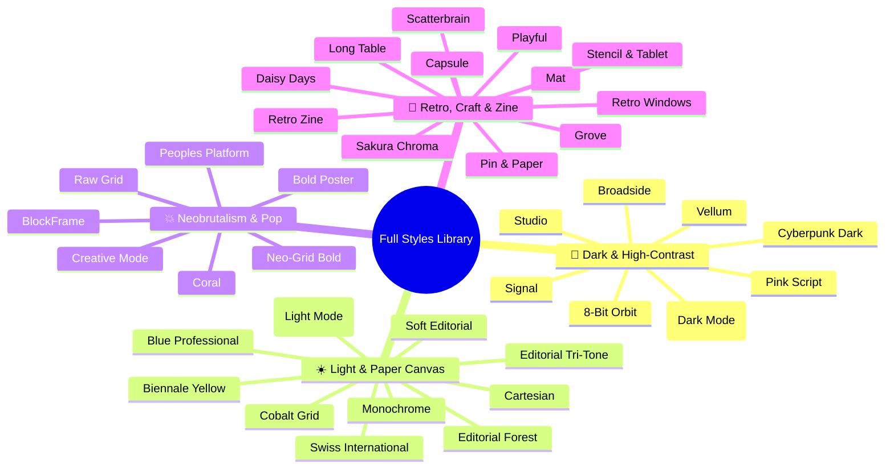

# 🎨 Full Design Styles & Presets Gallery (STYLE_GALLERY)

This repository includes **37 unique design system specifications** (35 from the Bold Template Pack plus classic core presets). Every style is engineered with strict typography hierarchies, curated color palettes, and balanced white space — avoiding generic "AI slop" aesthetics.

This gallery provides **1:1 visual previews, vibe/mood attributes, optimal use cases, color tokens, font stacks, and signature design elements** to help you pick the perfect visual language for any keynote, pitch deck, or conference talk.

---

## 🧭 Category Fast Track

---

## 📊 Complete Styles & Presets Table

| Preview | Preset Name & Slug | Vibe & Mood | Best For | Colors & Typography | Design Doc |
| :---: | :--- | :--- | :--- | :--- | :---: |
|  | **Beautiful Modern** `beautiful-modern` | Elegant, fluid glassmorphism | Tech keynotes, AI pitch decks | Ice Blue / Purple Neon / Frost `Plus Jakarta Sans` | [Spec](bold-template-pack/templates/beautiful-modern/design.md) |
|  | **Swiss International** `swiss-international` | Bauhaus grid, minimalist | Architecture, academic, systems | Pure White / Ink Black / Red `Helvetica / Archivo` | [Template](../resources/template-swiss.html) |
|  | **Cyberpunk Dark** `cyberpunk-dark` | Neon glow, hacker aesthetic | Tech talks, open source roadmaps | Pitch Black / Cyan Glow / Neon Pink `JetBrains Mono` | [Template](../resources/template.html) |
|  | **8-Bit Orbit** `8-bit-orbit` | Pixel art, retro gaming, CRT | Gaming, Web3, developer demos | Deep Navy / Neon Green / Yellow `Tektur / Space Mono` | [Spec](bold-template-pack/templates/8-bit-orbit/design.md) |
|  | **Biennale Yellow** `biennale-yellow` | Art biennale, literary poster | Museum annuals, design exhibitions | Warm Parchment / Solar Yellow / Indigo `Instrument Serif` | [Spec](bold-template-pack/templates/biennale-yellow/design.md) |
|  | **BlockFrame** `block-frame` | Chunky black borders, pop blocks | SaaS launch, agency credentials | Mint / Pastel Violet / Orange `Plus Jakarta Sans` | [Spec](bold-template-pack/templates/block-frame/design.md) |
|  | **Blue Professional** `blue-professional` | Crisp modern corporate, cobalt | B2B SaaS pitches, advisory reports | Off-White / Cobalt Blue `#0047FF` `Manrope` | [Spec](bold-template-pack/templates/blue-professional/design.md) |
|  | **Bold Poster** `bold-poster` | Massive serif, red accent | Brand manifestos, founder talks | Ivory Paper / Fire Red `#E63946` `Shrikhand / Serif` | [Spec](bold-template-pack/templates/bold-poster/design.md) |
|  | **Broadside** `broadside` | Dark newspaper tension, orange | Bilingual keynotes, bold manifestos | Pitch Black / Fire Orange `#FF5500` `Grotesk / Serif` | [Spec](bold-template-pack/templates/broadside/design.md) |
|  | **Capsule** `capsule` | Modular pills, candy pastel, Y2K | Creator portfolios, DTC launches | Bone White / Mint / Lilac / Peach `Plus Jakarta Sans` | [Spec](bold-template-pack/templates/capsule/design.md) |
|  | **Cartesian** `cartesian` | Classical restraint, large white space | Investment theses, policy briefs | Warm Linen / Charcoal Black `Playfair Display` | [Spec](bold-template-pack/templates/cartesian/design.md) |
|  | **Cobalt Grid** `cobalt-grid` | Technical graph paper, studious | Research bulletins, architecture | Graph Grid / Cobalt Blue `Modernist Serif` | [Spec](bold-template-pack/templates/cobalt-grid/design.md) |
|  | **Coral** `coral` | Charcoal, punchy coral, magazine | Fashion, lifestyle, creative reviews | Charcoal `#1A1A1A` / Coral `#FF6F61` `Bebas Neue` | [Spec](bold-template-pack/templates/coral/design.md) |
|  | **Creative Mode** `creative-mode` | Multi-color blocks, bold display | Design agencies, creative pitches | Warm Paper / Green / Pink / Orange `Archivo Black` | [Spec](bold-template-pack/templates/creative-mode/design.md) |
|  | **Daisy Days** `daisy-days` | Hand-drawn daisies, friendly pastel | Education, family, workshops | Soft Pastel / Sunny Yellow / Mint `Friendly Rounded` | [Spec](bold-template-pack/templates/daisy-days/design.md) |
|  | **Editorial Forest** `editorial-forest` | Forest green, dusty pink, quarterly | Sustainability, quarterly reviews | Forest Green `#1B4332` / Dusty Pink `Source Serif 4` | [Spec](bold-template-pack/templates/editorial-forest/design.md) |
|  | **Editorial Tri-Tone** `editorial-tri-tone` | Burgundy, dusty pink, mustard | Fashion lookbooks, art direction | Burgundy Red / Rose / Mustard `Bricolage Grotesque` | [Spec](bold-template-pack/templates/editorial-tri-tone/design.md) |
|  | **Emerald Editorial** `emerald-editorial` | Emerald field, double rules, gold | Executive readouts, strategy | Emerald Green `#0F3A2F` / Gold `Bodoni Moda / Serif` | [Spec](bold-template-pack/templates/emerald-editorial/design.md) |
|  | **Grove** `grove` | Classical forest green, rust accent | Sustainability, wineries, reports | Dark Forest Green `#162B1D` / Rust `Playfair Display` | [Spec](bold-template-pack/templates/grove/design.md) |
|  | **Long Table** `long-table` | Supper club, rust red, warm cream | Hospitality, food & wine, events | Warm Cream / Rust Red `#C84B31` `Fraunces` | [Spec](bold-template-pack/templates/long-table/design.md) |
|  | **Mat** `mat` | Dark sage, burnt orange, mid-century | Furniture, interior, ceramics | Dark Sage `#2E3830` / Burnt Orange `Lora / Sans` | [Spec](bold-template-pack/templates/mat/design.md) |
|  | **Monochrome** `monochrome` | Ivory ledger, all-black ink, honest | Research synthesis, whitepapers | Ivory Paper / Pure Black Ink `Lora / Jost` | [Spec](bold-template-pack/templates/monochrome/design.md) |
|  | **Neo-Grid Bold** `neo-grid-bold` | Neo-brutalism, neon yellow accent | Design talks, developer keynotes | White Paper / Neon Yellow / Bold Lines `Archivo Black` | [Spec](bold-template-pack/templates/neo-grid-bold/design.md) |
|  | **People's Platform** `peoples-platform` | Activist poster, blue/red/yellow | Community manifestos, civic actions | Poster Blue / Red / Warm Yellow `Alfa Slab One / Caveat` | [Spec](bold-template-pack/templates/peoples-platform/design.md) |
|  | **Pin & Paper** `pin-and-paper` | Grid paper, ink handwriting, pins | User interviews, qualitative research | Kraft Yellow / Ink Blue / Coral `Caveat / Space Mono` | [Spec](bold-template-pack/templates/pin-and-paper/design.md) |
|  | **Pink Script** `pink-script` | Midnight black, hot pink, luxury | Luxury product reveal, after-hours | Obsidian Black `#09090C` / Hot Pink `Instrument Serif` | [Spec](bold-template-pack/templates/pink-script/design.md) |
|  | **Playful** `playful` | Sun-warm peach, friendly sans | Creator launches, newsletters | Warm Peach `#FFE8DF` / Coral Red `Syne` | [Spec](bold-template-pack/templates/playful/design.md) |
|  | **Raw Grid** `raw-grid` | Raw brutalist borders, offset shadows | Founder pitches, accelerator demos | Raw Paper / Lilac Blocks / 4px Border `Plus Jakarta Sans` | [Spec](bold-template-pack/templates/raw-grid/design.md) |
|  | **Retro Windows** `retro-windows` | Windows 95 teal & 3D chrome | Tech history, retro gaming talks | Classic Teal Desktop / Gray Window `MS Sans Serif / Pixel` | [Spec](bold-template-pack/templates/retro-windows/design.md) |
|  | **Retro Zine** `retro-zine` | Riso print, soy ink overlays | Underground arts, indie publications | Kraft Paper / Pine Green / Terracotta `Bebas Neue / Caveat` | [Spec](bold-template-pack/templates/retro-zine/design.md) |
|  | **Sakura Chroma** `sakura-chroma` | 80s Japanese cassette, rainbow band | Hardware manuals, music releases | Off-White / Spectrum Ribbon / Heavy Sans `Space Mono / Bold Sans` | [Spec](bold-template-pack/templates/sakura-chroma/design.md) |
|  | **Scatterbrain** `scatterbrain` | Sticky notes whiteboard, brainstorm | Sprint retrospectives, design workshops | Dot Whiteboard / Pastel Yellow Stickies `Zilla Slab / Caveat` | [Spec](bold-template-pack/templates/scatterbrain/design.md) |
|  | **Signal** `signal` | Deep navy, muted gold, institutional | Board meetings, macro disclosures | Deep Navy `#0B192C` / Muted Gold `Cinzel / Bold Sans` | [Spec](bold-template-pack/templates/signal/design.md) |
|  | **Soft Editorial** `soft-editorial` | Morning light, sage green, airy | Longform essays, lifestyle brands | Soft Cream / Sage `#6B705C` / Pale Yellow `Cormorant Garamond` | [Spec](bold-template-pack/templates/soft-editorial/design.md) |
|  | **Stencil & Tablet** `stencil-tablet` | Stencil headlines, earth clay dyes | Field research, cultural heritage | Bone Parchment / Ochre / Terracotta `Space Mono / Stencil Sans` | [Spec](bold-template-pack/templates/stencil-tablet/design.md) |
|  | **Studio** `studio` | Black canvas, electric yellow | Creative studio pitches, fashion | Pitch Black `#0A0A0A` / Voltage Yellow `Archivo Black` | [Spec](bold-template-pack/templates/studio/design.md) |
|  | **Vellum** `vellum` | Deep scholarly navy, warm yellow serif | Theoretical physics, philosophy | Midnight Navy `#0B132B` / Golden Serif `Cormorant Garamond` | [Spec](bold-template-pack/templates/vellum/design.md) |

---

## 🎯 Selection Decision Matrix

### 1. 💼 Pitch Decks & Investor Relations
* **Recommended**: `beautiful-modern`, `blue-professional`, `signal`
* **Alternative**: `emerald-editorial`
* **Avoid**: `daisy-days`, `retro-windows`, `scatterbrain`

### 2. 🚀 Tech Talks & Developer Keynotes
* **Recommended**: `cyberpunk-dark`, `swiss-international`, `8-bit-orbit`
* **Alternative**: `cobalt-grid`, `studio`
* **Avoid**: `soft-editorial`, `daisy-days`

### 3. 🏛️ Whitepapers & Academic Reports
* **Recommended**: `cartesian`, `monochrome`, `vellum`
* **Alternative**: `editorial-forest`, `stencil-tablet`
* **Avoid**: `block-frame`, `creative-mode`

### 4. 🎨 Creative Agencies & Fashion Lookbooks
* **Recommended**: `creative-mode`, `coral`, `editorial-tri-tone`, `pink-script`
* **Alternative**: `biennale-yellow`, `bold-poster`

### 5. 🧸 Indie Makers & Community Events
* **Recommended**: `playful`, `capsule`, `long-table`
* **Alternative**: `retro-windows`, `sakura-chroma`, `pin-and-paper`
