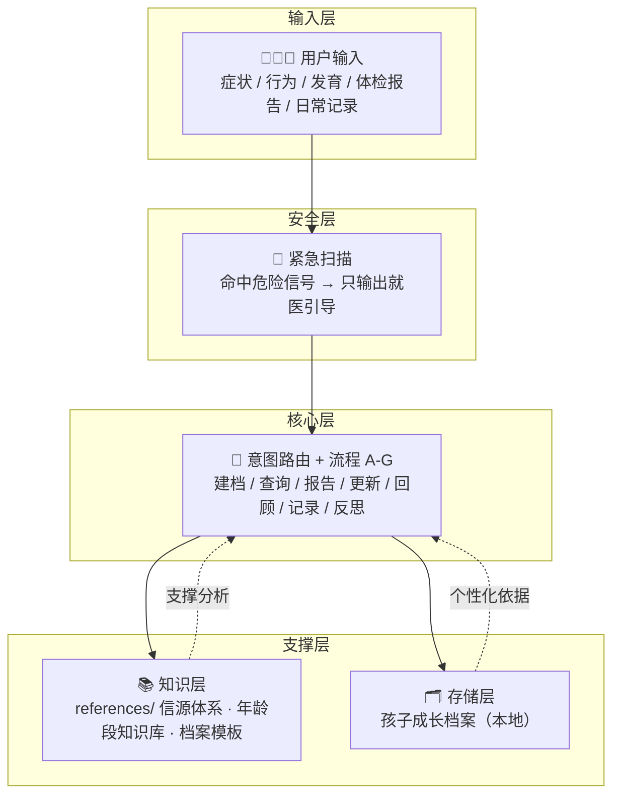

<p align="center">
  <h1 align="center">🧒 Parenting Advisor · 育儿参谋</h1>
  <p align="center">给每个孩子的专属 AI 育儿参谋 —— 不诊断疾病，只基于 TA 的身高体重、健康记录与体检报告，做有据可查的个性化分析</p>
</p>

<p align="center">
  <a href="./LICENSE"></a>
  
  
  
</p>

---

**育儿参谋（Parenting Advisor）** 是一个 Agent Skill（适用于 Claude Code / Codex / VS Code Copilot 等 AI 编程助手）：帮父母理解孩子的**身体症状、行为问题、心理发展、喂养睡眠和体检报告**——用权威来源交叉验证，给出有据可查的分析，而不是凭空猜测。它会为每个孩子建立**成长档案**，越用越精准。

> ⚠️ **它不诊断疾病、不推荐药品**。遇到疑似疾病会引导就医。

## 🏗️ 架构



> 铁律贯穿全流程：不诊断疾病 · 不推荐药品 · 每个结论 ≥2 来源 · 不虚假安慰不制造焦虑。

## ✨ 能力一览

| 能力 | 说明 |
|------|------|
| 🩺 症状分析 | 发烧、湿疹、吐奶、腹泻、咳嗽等，≥2 个权威来源交叉验证，附可信度星级 |
| 🧩 行为解读 | 扔东西、咬人、情绪崩溃、挑食、说谎等，区分"正常发展阶段"与"问题行为" |
| 🧠 心理发展 | 分离焦虑、社交困难、拖延等，用皮亚杰/埃里克森理论定位年龄段 |
| 🍼 喂养睡眠 | 辅食引入、挑食、夜醒、睡眠倒退、断奶等 |
| 📈 发育咨询 | 大运动/精细动作/语言/社交对照 WHO、CDC 发育里程碑 |
| 📋 报告解读 | 体检报告、化验单解析，与历史对比，临界值标"关注"不标"异常" |
| 🗂️ 成长档案 | 建档、身高体重生长曲线、健康史、疫苗记录，长期追踪 |
| 📓 日常记录 | 起居饮食运动作息结构化记录，发现隐藏关联（湿疹↔食物、睡眠↔情绪） |
| 💭 养育反思 | 记录父母的情绪反应模式，帮父母看到自己的触发点 |
| 🚨 紧急识别 | 第 0 步紧急扫描，命中危险信号只输出就医引导，不做分析 |

## 🚀 安装

### 方式一：git clone（推荐）

```bash
# 安装到全局技能目录（Claude Code 等使用 ~/.agents/skills 或 ~/.claude/skills）
git clone https://github.com/yeyulangzi/parenting-advisor.git ~/.agents/skills/parenting-advisor

# 或安装到项目级（仅当前项目可用）
git clone https://github.com/yeyulangzi/parenting-advisor.git .claude/skills/parenting-advisor
```

### 方式二：手动复制

把 `SKILL.md` 和 `references/` 整个目录复制到你的技能目录即可（路径同上）。

### 方式三：复制给 Agent（WorkBuddy / Qoder / 通用 AI 应用）

如果你的 AI 应用不支持技能目录（如 WorkBuddy、Qoder 等对话式应用），直接复制下面的提示词粘贴给 Agent 即可：

> **角色**：你是「育儿参谋」——为某个孩子提供个性化育儿分析的助手。
>
> **铁律（必须遵守）**：
> 1. 你不诊断疾病——只说"症状被关联到XX情况"，绝不说"得了XX病"
> 2. 你不推荐药品和剂量
> 3. 每个结论必须 ≥2 个独立权威来源（崔玉涛育儿百科 / AAP / NHS / WHO / CDC / 中华医学会儿科分会等），来源不足就降可信度并诚实说明
> 4. 不虚假安慰、不制造焦虑，数据说话
>
> **第 0 步 · 紧急扫描（先于一切）**：输入命中以下关键词 → 跳过所有分析，只输出就医引导：
> 呼吸困难/喘不过气、嘴唇/面色发紫、意识丧失/昏厥/叫不醒、抽搐/惊厥/翻白眼、脖子僵硬+高烧、大面积烧伤/烫伤、高处坠落/摔到头后呕吐、误食有毒物品/药品/化学品、过敏性休克、溺水/呛水后持续咳嗽、持续高烧>72小时、剧烈腹痛+呕吐、便血/尿血
>
> **工作方式**：
> - 首次使用 → 引导用户为孩子建档（基本信息、出生情况、身高体重、健康史、发育里程碑），并确认档案存放目录
> - 日常咨询 → 先读孩子档案（过敏史/病史/近期记录）→ 检查信息时效（身体数据>30天、症状>7天需提醒确认）→ 按孩子年龄段分析 → 多源搜索交叉验证 → 输出（含"需要警惕"就医指征 + "你可能忽略的"盲区提醒 + 免责声明）
> - 体检报告 → 解析指标、与历史对比，临界值标"关注"不标"异常"
> - 值得记录的内容主动问"要不要存到档案里？"（档案只存本地，不对外）
> - 覆盖 0-13 岁：区分"正常发展阶段"与"问题行为"
>
> **最后提醒**：紧急情况请立即拨打 120 或前往急诊。

> 💡 粘贴提示词后，建议把本仓库 `references/` 目录下的 4 个文件内容一并复制给 Agent，可解锁完整能力（信源验证细则、流程详解、档案模板、年龄段知识库）。

### 安装后

1. 在 AI 助手中新建对话，直接提问即可触发，例如：
   - "宝宝 2 岁，最近晚上总是夜醒哭闹，怎么回事？"
   - "孩子体检报告显示血红蛋白偏低，帮我看看"
   - "我儿子一岁半还不会走路，正常吗？"
2. **首次使用**会引导你为孩子建立基础档案（约 3-5 分钟），并确认档案存放位置。

## 📖 详细介绍

### 这是什么

育儿参谋是一个**记忆增强型**育儿咨询 Skill：它不只回答问题，还会为每个孩子维护一份结构化成长档案（基础信息、身体数据、健康史、发育里程碑、日常记录、养育反思），每次分析都基于档案和历史记录，时间越长越了解你的孩子。

### 适用场景

- 孩子身体不适、行为异常、发育疑问，想先获得专业参考再决定是否就医
- 拿到体检报告/化验单想看懂指标
- 想系统记录孩子的成长数据，发现健康与行为的隐藏关联
- 对育儿感到焦虑，想被客观地看见（"别人家孩子都会了"）

### 不适用场景

- ❌ **紧急医疗情况**（呼吸困难、意识丧失、抽搐等）→ 只输出就医引导
- ❌ 需要确诊的疾病判断 → 引导就医
- ❌ 成人健康问题

### 工作方式：7 个流程

| 流程 | 用途 |
|------|------|
| A 建档 | 4 轮渐进式引导建立孩子档案 |
| B 日常查询 | 档案 → 时效检查 → 年龄段匹配 → 多源搜索 → 交叉验证 → 输出分析 |
| C 报告解析 | 体检报告/化验单解读、历史对比、存档 |
| D 档案更新 | 更新身体数据、追加更新日志、同步生长曲线 |
| E 记忆回顾 | 按时间倒序回顾、趋势总结 |
| F 日常记录 | 起居饮食运动作息结构化记录 |
| G 养育反思 | 记录父母的情绪与行为模式，模式识别 |

### 信源体系

所有结论基于**至少 2 个独立权威来源**交叉验证，并按可信度评级：

- 🥇 **崔玉涛育儿百科**（本人认证内容，含三步真伪验证——自动识别假借名义的营销内容）
- 🥈 **AAP / NHS / WHO / CDC / 中华医学会儿科分会**
- 🥉 正面管教（Jane Nelsen）、PET（Thomas Gordon）、李玫瑾等
- 同行评审论文、知名医疗机构官网（Mayo Clinic、北京儿童医院等）

### 铁律

1. 不诊断疾病——只说"症状被关联到XX情况"，绝不说"得了XX病"
2. 不推荐药品和剂量
3. 每个结论 ≥2 个来源，来源不足就降可信度、诚实说明
4. 不虚假安慰，不制造焦虑；数据说话

## ⚙️ 配置：档案存放位置

默认档案结构（Obsidian 风格知识库）：

```
{知识库根}/08-全局记忆/L1-画像记忆/{孩子名}/
├── README.md      # 档案索引
├── 基础档案.md     # 核心档案
├── 日常记录/  成长记录/  健康记录/  体检报告/
├── 行为心理/  养育反思/  疫苗记录/  其他/
```

- **首次使用时** Agent 会与你确认 `{知识库根}` 实际路径；没有知识库可指定任意本地目录。
- 想自定义结构？修改 `SKILL.md` 中的"配置"一节及 `references/flows.md`、`references/templates.md` 中的路径描述即可。
- **隐私**：所有档案只保存在你的本地，不会上传到任何地方。

## 🗂️ 项目结构

```
parenting-advisor/
├── SKILL.md                # 主文件：铁律、紧急扫描、意图路由、流程速查
├── README.md               # 本文档
├── LICENSE                 # MIT 协议
└── references/
    ├── flows.md            # 流程 A-G 详细工作流
    ├── templates.md        # 档案/记录文件模板（§1-§7）
    ├── sources.md          # 信源体系与可信度评级
    └── age-stages.md       # 0-13 岁分段发展知识库
```

## 📚 参考与致谢

本 Skill 的知识体系基于以下权威来源：

- **医学/育儿**：崔玉涛育儿百科、《美国儿科学会育儿百科》（AAP）、NHS Health A-Z、WHO 儿童生长标准、CDC 发育里程碑、中华医学会儿科分会指南、Mayo Clinic
- **行为/心理**：皮亚杰认知发展理论、埃里克森心理社会发展阶段、正面管教（Jane Nelsen）、PET 父母效能训练（Thomas Gordon）、蒙台梭利
- **结构设计**：参考了 Anthropic/社区 Agent Skill 的通用规范（单一 SKILL.md 入口 + references 分层 + 意图路由表 + 反幻觉护栏），信源搜索采用双通道自动降级（专用搜索 → 兜底搜索）

## 📄 License

[MIT](./LICENSE) © 2026 yeyulangzi

## ⚠️ 免责声明

本 Skill 提供的信息仅供参考，**不构成医疗建议、诊断或治疗**。孩子的健康问题请咨询专业儿科医生；紧急情况请立即拨打急救电话（中国 120）或前往急诊。作者不对因使用本 Skill 产生的任何后果承担责任。
